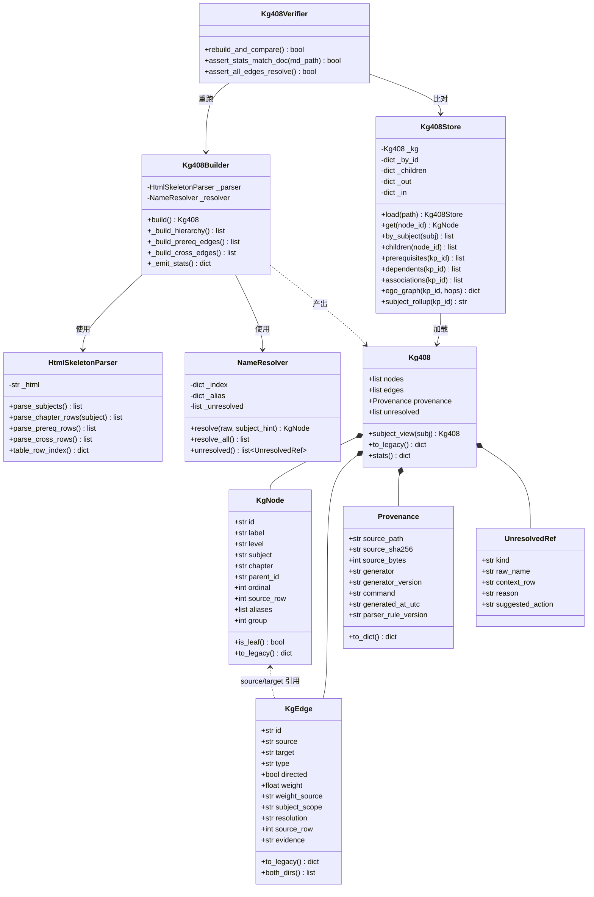
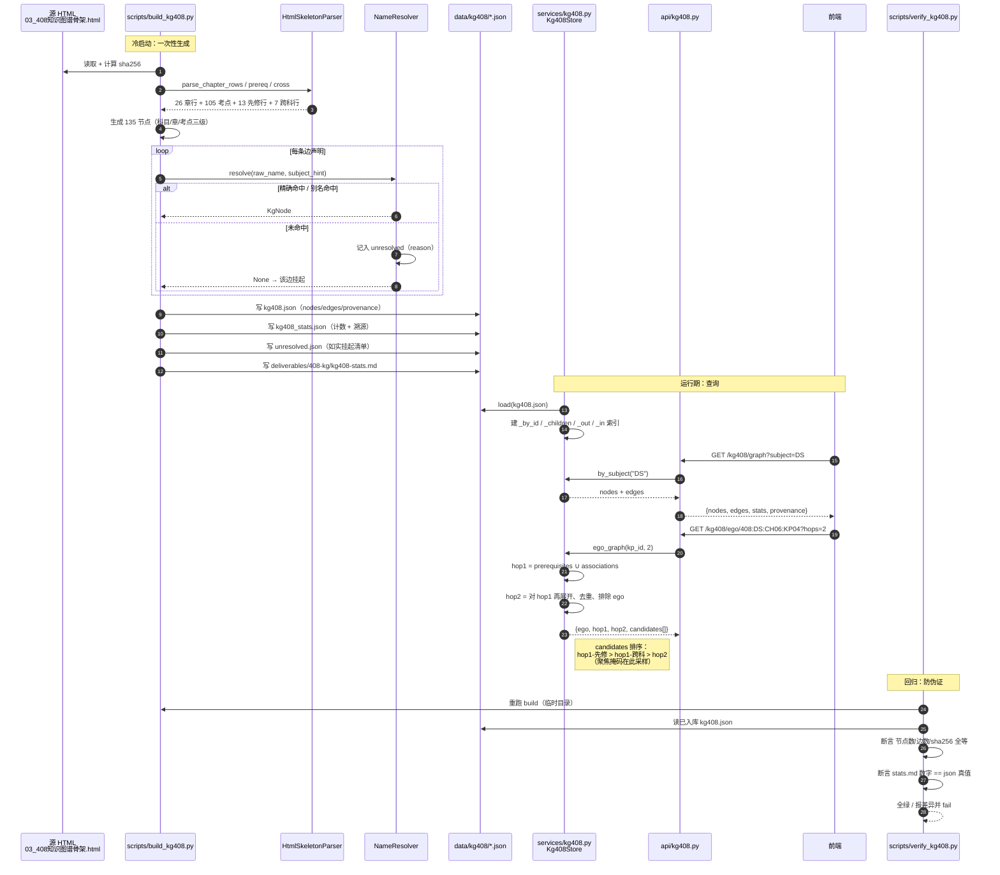
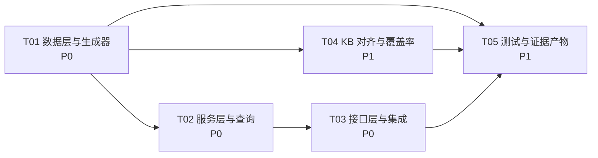

# 架构设计 — 408 知识图谱骨架导入 芒得很职

> 作者：高见远（架构师） · 日期：2026-09-24 · 状态：**设计稿，未实现**
> 落盘位置：`deliverables/408-kg/`（本次仅新增文件，未改动任何既有源码）
> 数据源：`E:\Program\MARL\SAGE\pdf\03_408知识图谱骨架.html`（9995 字节，已实测存在）

---

## 0. 结论先行（给决策人的 6 句话）

| # | 结论 |
|---|---|
| 1 | **任务简报中的「图谱是空壳 / 0 entities / 0 relationships」是测量口径错误**。实测 `KNOWLEDGE_GRAPH` = **643 节点 / 639 边**——它用 `nodes`/`edges` 键，不含 `entities`/`relationships`。 |
| 2 | 真正的病不是「空」，是**结构退化**：无层级、无边类型、无方向语义、86% 节点是程序化生成的填充物（其中 `group=1` 一个桶里塞了 300 个节点）。 |
| 3 | 因此本设计的定位从「填空壳」修正为：**用一份可复现的、有三级层级和两类边的 curated 图谱，替换/并置于现有退化图谱之上**。 |
| 4 | **不新增 `CN_KNOWLEDGE_GRAPH`**，也不再手写任何常量：单一真源 = 脚本从 HTML 生成的 `kg408.json`，分科视图全部由它导出（杜绝双份漂移）。 |
| 5 | 向后兼容靠**「只加字段、不改字段」**：现有 4 个消费方只读 `id/label/group/source/target`，新增字段对它们零影响（已逐个核验）。 |
| 6 | **源 HTML 的边引用了一批骨架里不存在的概念名**（递归、分治、资源分配、滑动窗口等）。这是本次最大风险。设计强制落 `unresolved.json` 如实挂起，**禁止模糊匹配凑数**。 |

---

## 1. 现状实测（本设计为这些数字负责）

> 全部由本机 `python -c` 实测得出，非引自文档。命令与输出见 §10.2。

### 1.1 四个图谱常量真实规模

| 常量 | 键 | nodes | edges | 简报口径 | 实测口径 |
|---|---|---|---|---|---|
| `KNOWLEDGE_GRAPH` | `nodes`/`edges` | **643** | **639** | 0 / 0 ❌ | 643 / 639 ✅ |
| `DS_KNOWLEDGE_GRAPH` | `nodes`/`edges` | 20 | 19 | 0 / 0 ❌ | 20 / 19 ✅ |
| `CO_KNOWLEDGE_GRAPH` | `nodes`/`edges` | 11 | 14 | 0 / 0 ❌ | 11 / 14 ✅ |
| `OS_KNOWLEDGE_GRAPH` | `nodes`/`edges` | 12 | 13 | 0 / 0 ❌ | 12 / 13 ✅ |
| `CN_KNOWLEDGE_GRAPH` | — | **不存在** | — | 不存在 | 确认不存在 ✅ |

- 节点字段全集：`{id, label, group}`；边字段全集：`{source, target}`。
- `SEED_KNOWLEDGE_CHUNKS` = **1892**（简报 1883，实测 1892）；`SEED_QUESTIONS` = **230**（简报 200，实测 230）。
- 简报「运行时 7 个文件合计 5 entities / 0 relationships」属实，但那是 **LLM 抽取 Agent**（`agents/knowledge_graph.py`）的产物，是**另一套 schema**，与 `seed_data` 无关。详见 §2。

### 1.2 643 节点的构成（退化证据）

| 来源 | 量级 | 说明 |
|---|---|---|
| 手工编写（CN 45 + DS 20 + CO 11 + OS 12） | ≈88 | 真正的人工设计 |
| `*_EXPANDED_KG_NODES` | 中 | 扩展常量 |
| `_AUTO_KG_NODES` / `_AUTO_KG_NODES2` | 大 | 由 `LEARNING_PATH_DAG.topics` 与 chunk `sub_topic` 展开 |
| `_Q_KG_NODES`（`q_*`） | 230 | 每题一个节点 |
| `_FINE_KG_NODES` | 大 | chunk `sub_topic × dimension` 笛卡尔切分 |
| `_CROSS_NODES`（`cross_*`） | 20 | 跨学科概念 |
| **合计** | **643** | |

`group` 分布：**group=1 占 300 个**（`q_*` 硬编码 `group:1` + `cross_*` 硬编码 `group:1`），其余散落在 2–26。→ `group` 已丧失「科目/章」语义。

### 1.3 源 HTML 精确体量（已解析实测，非估算）

| 项 | 数值 |
|---|---|
| 科目 | **4**（DS / CO / OS / CN） |
| 章（科目内唯一） | **26**（DS 8 / CO 7 / OS 5 / CN 6） |
| 考点三元组 `(科目,章,考点)` | **105**（DS 35 / CO 22 / OS 20 / CN 28） |
| 考点**去重名称** | 104（**`流量控制` 在 CN 数据链路层与 CN 传输层各出现一次**） |
| 节点合计 | **135** = 4 + 26 + 105 |
| 先修边声明 | **13 行 → 23 条边声明**（部分行含多个先修） |
| 跨科关联 | **7 行**，非 `—` 单元格 **16 个** |

> ⚠️ 简报写「约 104 考点 + 28 章 ≈ 136 节点」「先修边 11 条」。实测为 **105 / 26 / 135 节点、23 条先修边声明**。以本表为准。

---

## 2. 关键发现：项目里存在**两套互相不通的图谱 schema**

这是本次设计成败的枢纽，必须先讲清。

| | **Schema A（seed_data / 可视化）** | **Schema B（LLM 抽取 Agent）** |
|---|---|---|
| 容器键 | `nodes` / `edges` | `entities` / `relationships` |
| 节点字段 | `id`, `label`, `group` | `id`, `name`, `type`, `description`, `importance`, `tags`, `cognitive_level`, `category` |
| 边字段 | `source`, `target` | `source`, `target`, `type`, `description` |
| 定义处 | `seed_data.py:461,738,927,1066` | `agents/knowledge_graph.py:56-66` |
| 落盘 | 无（内存常量） | `data/knowledge_graphs/*.json`（7 个测试残留） |
| 桥接 | — | `kg_to_vis_json()` → `{nodes:[{id,label,title,group,color,value}], edges:[{from,to,...}]}` |
| 消费方 | `api/subjects.py`、`api/knowledge.py`、`api/teacher.py`、`engines/frugal_rag_sft.py` | `api/knowledge_graph.py`、`前端 KnowledgeGraphView.vue` |

**额外坑**：Schema B 的 vis 输出用 `from`/`to`，Schema A 用 `source`/`target`——前端两套组件各吃一套。

### 2.1 决策：扩展 Schema A，不发明第三套

**理由**：408 骨架要被「出题/引导/检索」消费，而这条链上全是 Schema A。且 Schema A 消费方全部用 `.get()` 或只取子集字段，**只加不改即可零改动兼容**（逐方核验见 §4.3）。

### 2.2 `group` 语义冲突（已存在的技术债，本设计绕开它）

| 端点 | `group` 含义 |
|---|---|
| `POST /knowledge/graph`（`api/knowledge.py:530`） | **科目在 `SEED_SUBJECTS` 中的 1-based 索引**（1–27），前端 `applyFilter` 依赖它 |
| `GET /knowledge-graph`（`api/subjects.py:24`） | **章节编号**（13–26），与上一行完全冲突 |

→ 同一个字段两个语义，**本设计不为它背书**：408 图谱自带 `subject` + `chapter` 显式字段，过滤一律走这两个字段；`group` 仅在「兼容投影」里按 `POST /knowledge/graph` 口径回填。

---

## 3. 实现方案与选型

### 3.1 五个核心决策（含备选与取舍）

| 编号 | 问题 | 选定方案 | 备选 | 为什么否掉备选 |
|---|---|---|---|---|
| **D1** | 用哪套 schema | 扩展 Schema A（`nodes`/`edges`），只加字段 | 新建 Schema C 统一两套 | 统一要改 4 个消费方 + 2 个前端组件，风险/收益比差；中期检查前不动 |
| **D2** | 四个常量怎么组织 | **单一真源 `kg408.json`**，分科视图运行时导出 | 分别填 `DS_/CO_/OS_/CN_KNOWLEDGE_GRAPH` | 5 份手抄必然漂移；且现有 `DS_/CO_/OS_` 已被 `seed_data.py:1280-1303` 用 `_adjust_groups()` 偏移合并过一次——那正是漂移现场 |
| **D3** | 是否新增 `CN_KNOWLEDGE_GRAPH` | **否**。提供 `KG408.subject_view("CN")` | 补第 4 个常量凑齐 | 补了就是第 5 份真源，正是要消灭的模式。若确需常量名，只做 `CN_KG408 = KG408.subject_view("CN")` 一行派生别名 |
| **D4** | 是否删除/改写 legacy `KNOWLEDGE_GRAPH` | **默认不改**，`KG408` 并存；提供一次性「兼容投影」 | 直接替换 643 节点 | 有 4 个消费方 + 若干测试可能断言规模；替换会炸。并存零风险，且能并列对比做证据 |
| **D5** | 可复现性怎么保证 | **脚本生成 + `sha256` 溯源 + 校验脚本断言「文档数 == 代码数」** | 人写常量 | 项目踩过「文档 613 / 代码 0」的伪证坑，必须机检 |

### 3.2 技术选型

| 层 | 选型 | 理由 |
|---|---|---|
| 解析 | **Python 标准库** `html.parser` + `re` | 源是 9.9KB 静态表格，`<tr>/<td>` 结构规整；**零新增依赖**，避免装包失败（本项目有 CI 装包事故史） |
| 存储 | **单个 JSON 文件** `data/kg408/kg408.json` | 135 节点规模，JSON 足够；内容可入库 → 可 `git diff` 审阅 → 可复算，比 DB 更适合当「证据」 |
| 查询 | **内存索引 dict**（`services/kg408.py`） | 135 节点全量常驻 <1MB；ego-graph 1–2 跳查询 O(deg²)，无需图数据库 |
| 持久化 | 不引入 Neo4j | 现有 `db/graph_db.py` 已有 Neo4j/Memory 双实现，但它是 **章级**（`group_1..group_26`），与本次**考点级**粒度不同层；本设计不劫持它，仅留适配口（§3.5） |
| 测试 | 既有 `pytest`（`pyproject.toml` test 组已配） | 不新增 |

### 3.3 三级层级与 ID 规则（稳定性是可复现的前提）

```
408:<SUBJ>                     科目   e.g. 408:DS
408:<SUBJ>:CH<nn>              章     e.g. 408:DS:CH02      (nn = 该科目内表格行序，2 位补零)
408:<SUBJ>:CH<nn>:KP<nn>       考点   e.g. 408:DS:CH02:KP03 (nn = 该章内 "、" 分隔序，2 位补零)
408:E:PRE<nnnn>                先修边
408:E:XSUB<nnnn>               跨科关联边
```

- **ID 由「源表格行序」决定，不由内容决定** → 同一份源 HTML 重跑必得同一套 ID（`git diff` 干净）。
- **必须带章前缀**：实测 `流量控制` 在 CN 的两个章下重名；章名 `输入输出` 在 CO 与 OS 下重名。用名称做 ID 会撞车。

### 3.4 边的两种类型（方向约定是重点，见 §8）

| 类型 | `type` | `directed` | `subject_scope` | `weight` | 条数 |
|---|---|---|---|---|---|
| 先修边 | `prerequisite` | `true` | `intra` | — | 23 条声明 |
| 跨科关联边 | `association` | `false` | `cross` | **源未提供数值** | 7 行 → 团扩展后 6–16 条 |

**关于权重（诚信相关）**：源 HTML §3 表头只有「关联 / DS / CO / OS / CN」五列，**没有任何权重数值列**。源文档 §4 文字写了「权重=关联强度」，但那是**意图声明，不是数据**。因此：
- `weight` 字段落 **`null`**，并附 `weight_source: "not_provided_by_source"`。
- **禁止**为了有数字而填 `0.5`/`1.0` 假装是关联强度。
- 后续若要用权重，两条合法路径：① 人工标注（写入 alias 表，标 `weight_source: "manual"`）；② 由错题共现频率学习得出（标 `"learned_from_error_cooccurrence"`）。

### 3.5 与章级 `MemoryGraphDB` 的关系

`db/graph_db.py` 的 `MemoryGraphDB` 在 **group（章）级**工作（`group_1..group_26`），`get_prerequisites()` 返回 `group_*`。408 图谱是**考点级**，粒度更细，二者**不是替代关系**。
本设计：`KG408` 独立提供服务；T05 提供一个可选的「考点级 → 章级上卷」函数，供 `MemoryGraphDB` 未来消费。**本期不改 `graph_db.py`。**

---

## 4. 数据模型与接口

### 4.1 Node / Edge 字段规范

**Node（在现有 `id`/`label`/`group` 之上新增，粗体=新增）**

| 字段 | 类型 | 必填 | 说明 |
|---|---|---|---|
| `id` | str | ✅ | `408:DS:CH02:KP03` |
| `label` | str | ✅ | 考点原名，如 `循环链表` |
| `group` | int\|null | ✅(可 null) | **兼容字段**，`POST /knowledge/graph` 口径的科目索引；映射不上时为 `null` |
| **`level`** | enum | ✅ | `subject` \| `chapter` \| `knowledge_point` |
| **`subject`** | str | ✅ | `DS`\|`CO`\|`OS`\|`CN`（科目节点自身也有值） |
| **`chapter`** | str\|null | ✅ | 章名；`level=subject` 时为 `null` |
| **`parent_id`** | str\|null | ✅ | 父节点 id；`level=subject` 时为 `null` |
| **`ordinal`** | int | ✅ | 同级序号（1-based），用于稳定排序 |
| **`source_row`** | int | ✅ | 溯源：源 HTML 表格行号 |
| **`aliases`** | list[str] | ✅ | 用于名称解析的别名 |

**Edge（在现有 `source`/`target` 之上新增）**

| 字段 | 类型 | 必填 | 说明 |
|---|---|---|---|
| `source` | str | ✅ | 见 §8 方向约定 |
| `target` | str | ✅ | 见 §8 方向约定 |
| **`id`** | str | ✅ | `408:E:PRE0001` |
| **`type`** | enum | ✅ | `prerequisite` \| `association` |
| **`directed`** | bool | ✅ | `true` / `false` |
| **`weight`** | float\|null | ✅ | **先修边恒 `null`**；关联边默认 `null`（源未提供） |
| **`weight_source`** | enum | ✅ | `not_applicable` \| `not_provided_by_source` \| `manual` \| `learned_from_error_cooccurrence` |
| **`subject_scope`** | enum | ✅ | `intra` \| `cross` |
| **`resolution`** | enum | ✅ | `exact` \| `alias` \| `chapter_level` \| `manual` —— **解析方式必须留痕** |
| **`source_row`** | int | ✅ | 溯源 |
| **`evidence`** | str | ✅ | 原文片段，如 `最短路径 Dijkstra ← 图存储、BFS` |

### 4.2 类图



### 4.3 消费方逐方核验（向后兼容性证据）

| 消费方 | 读取字段 | 加字段后是否受影响 | 结论 |
|---|---|---|---|
| `api/subjects.py:46-57` | `n["id"]`、`n.get("group")`、`e.get("source"/"target")` | 否（子集读取） | ✅ 兼容 |
| `api/knowledge.py:558-577` | 重新构造 `{id,label,group}` / `{source,target}` | 否（白名单投影） | ✅ 兼容 |
| `api/teacher.py:129-130` | `len(KNOWLEDGE_GRAPH["nodes"/"edges"])` | 否 | ✅ 兼容（但**本期不动它**，它继续统计 legacy 图） |
| `engines/frugal_rag_sft.py:501-507` | `edge["source"]`、`edge["target"]` | 否 | ✅ 兼容 |
| 前端 `studyStore.fetchKnowledgeGraph` → `POST /knowledge/graph` | `nodes[{id,label,group}]`、`edges[{source,target}]` | 否 | ✅ 兼容 |
| `db/graph_db.py` `MemoryGraphDB` | 读 `agents/kg_dag.py`，**不读 seed_data** | 否 | ✅ 无关 |

---

## 5. 程序调用流程



---

## 6. 文件清单

> 根目录 = `E:\Program\MARL\study-help-pro`。**本次设计阶段零改动**；下表为实施期范围。

### 6.1 新增

| # | 相对路径 | 类型 | 说明 |
|---|---|---|---|
| 1 | `py-server/scripts/build_kg408.py` | 新增 | 转换器主脚本（解析→解析名→建图→落盘→出统计） |
| 2 | `py-server/scripts/verify_kg408.py` | 新增 | 重跑比对 + 断言「文档数 == 代码数」 |
| 3 | `py-server/scripts/bind_kb_to_kg408.py` | 新增 | 1892 条 KB chunk 与 105 考点对齐 + 覆盖率报告 |
| 4 | `py-server/data/kg408/kg408_alias.json` | 新增·**人工维护** | 名称解析别名表（含 `resolution` 与可选 `weight`） |
| 5 | `py-server/data/kg408/kg408_chapter_map.json` | 新增·**人工维护** | 26 骨架章 ↔ 27 `SEED_SUBJECTS` 章映射 + 未映射说明 |
| 6 | `py-server/data/kg408/kg408.json` | 新增·**生成** | 单一真源（135 节点 + 边 + provenance） |
| 7 | `py-server/data/kg408/kg408_stats.json` | 新增·**生成** | 统计 + 溯源 |
| 8 | `py-server/data/kg408/unresolved.json` | 新增·**生成** | 未解析引用清单（诚信产物） |
| 9 | `py-server/data/kg408/kp_chunk_binding.json` | 新增·**生成** | chunk↔考点 绑定明细 |
| 10 | `py-server/data/kg408/kp_chunk_coverage.json` | 新增·**生成** | 覆盖率统计 |
| 11 | `py-server/services/kg408.py` | 新增 | `Kg408Store` 加载/索引/查询（含 ego-graph） |
| 12 | `py-server/api/kg408.py` | 新增 | `GET /kg408/graph`、`/kg408/ego/{id}`、`/kg408/stats`、`/kg408/unresolved` |
| 13 | `py-server/tests/test_kg408.py` | 新增 | 单元测试 + 可复现性测试 |
| 14 | `deliverables/408-kg/架构设计-408知识图谱导入.md` | 新增 | 本文档 |
| 15 | `deliverables/408-kg/kg408-stats.md` | 新增·**生成** | 可引用统计（带 provenance） |
| 16 | `deliverables/408-kg/kb-alignment.md` | 新增·**生成** | KB 对齐覆盖率报告 |
| 17 | `deliverables/408-kg/class-diagram.mermaid` | 新增 | 类图源文件 |
| 18 | `deliverables/408-kg/sequence-diagram.mermaid` | 新增 | 时序图源文件 |

### 6.2 修改（实施期，均为极小改动）

| # | 相对路径 | 改动 | 风险 |
|---|---|---|---|
| 19 | `py-server/api/__init__.py` | 加 2 行：import + 加入导出列表 | 低 |
| 20 | `py-server/main.py` | 加 2 行：`include_router` | 低 |

### 6.3 **明确不改动**（红线）

| 路径 | 原因 |
|---|---|
| `py-server/seed_data.py` | 643 节点 legacy 图 + 4 个消费方 + 潜在断言；**默认并存不替换** |
| `src/views/CareerTrainingView.vue` / `TeacherCareerView.vue` | career-literacy 并发 WIP，禁止扰动 |
| `py-server/db/graph_db.py`、`py-server/agents/kg_dag.py` | 章级图，与本次考点级不同层 |
| `py-server/agents/knowledge_graph.py` | Schema B（LLM 抽取），不在本次范围 |
| `py-server/data/knowledge_graphs/*.json` | 7 个历史测试残留，不动 |

---

## 7. 任务分解

### 7.1 依赖包

**无需新增任何第三方依赖。** 解析用标准库 `html.parser` + `re`；落盘 `json`；溯源 `hashlib`；测试用既有 `pytest`。

```
# 新增：无
# 复用（已在 py-server/pyproject.toml）：
#   fastapi>=0.136.3    — 新路由
#   pydantic>=2.0.0     — 响应模型
#   pytest>=8.0.0       — tests/test_kg408.py
```

> 说明：刻意避开 `beautifulsoup4` / `lxml`。源仅 9.9KB 且表格规整，标准库足够；本项目有 CI 装包事故史（见 `pyproject.toml` 中 MeloTTS 注释），能不装就不装。

### 7.2 任务列表（按依赖顺序）

| ID | 任务 | 涉及文件 | 依赖 | 优先级 |
|---|---|---|---|---|
| **T01** | **图谱数据层与可复现生成器** | `scripts/build_kg408.py`、`scripts/verify_kg408.py`、`data/kg408/kg408_alias.json`、`data/kg408/kg408_chapter_map.json`、`data/kg408/kg408.json`、`data/kg408/kg408_stats.json`、`data/kg408/unresolved.json` | — | **P0** |
| **T02** | **服务层：加载/索引/ego-graph 查询** | `services/kg408.py`、`data/kg408/kg408.json`、`scripts/verify_kg408.py` | T01 | **P0** |
| **T03** | **接口层与路由集成** | `api/kg408.py`、`api/__init__.py`(改)、`main.py`(改)、`services/kg408.py` | T02 | **P0** |
| **T04** | **KB chunk ↔ 考点对齐与覆盖率报告** | `scripts/bind_kb_to_kg408.py`、`data/kg408/kp_chunk_binding.json`、`data/kg408/kp_chunk_coverage.json`、`deliverables/408-kg/kb-alignment.md`、`data/kg408/kg408_chapter_map.json` | T01 | **P1** |
| **T05** | **测试、统计产物与真值对齐** | `tests/test_kg408.py`、`deliverables/408-kg/kg408-stats.md`、`scripts/verify_kg408.py`、`deliverables/408-kg/class-diagram.mermaid`、`deliverables/408-kg/sequence-diagram.mermaid` | T01, T04 | **P1** |

#### T01 验收标准
- [ ] `python scripts/build_kg408.py --source "E:/Program/MARL/SAGE/pdf/03_408知识图谱骨架.html" --out-dir py-server/data/kg408` 零报错退出。
- [ ] `kg408.json` 节点数 **恰为 135**（4 科目 + 26 章 + 105 考点）；无重复 `id`。
- [ ] 每个非科目节点 `parent_id` 指向存在的父节点；无孤儿（除 4 个根）。
- [ ] 先修边条数 **≤ 23**；`unresolved.json` 列出每一条未能解析的声明及其 `reason`。
- [ ] 全部边 `source`/`target` 均指向存在的节点 id（**无悬空引用**）。
- [ ] `provenance` 含 `source_sha256`（对源 HTML 计算）、`command`、`generated_at_utc`、`parser_rule_version`。
- [ ] **连跑两次，`git diff` 为空**（ID 稳定性）。
- [ ] 未解析项**不得**被模糊匹配强行绑定；`resolution` 字段只取 `exact/alias/chapter_level/manual`。

#### T02 验收标准
- [ ] `Kg408Store.load()` 建成 `_by_id`/`_children`/`_out`/`_in` 四类索引。
- [ ] `prerequisites("408:DS:CH06:KP04")` 返回**出边**（先修项），与 §8 方向约定一致。
- [ ] `associations(kp)` 对 `directed=false` 的边**双向**返回。
- [ ] `ego_graph(kp, hops=2)` 返回 `{ego, hop1, hop2, candidates}`，`hop1` 排除自身、`hop2` 排除 `ego∪hop1`；`candidates` 按 `hop1-先修 > hop1-跨科 > hop2` 排序。
- [ ] `subject_view("CN")` 返回 CN 子树，边两端均在子树内。

#### T03 验收标准
- [ ] `GET /kg408/graph?subject=DS|CO|OS|CN|all` 返回 `{nodes, edges, stats, provenance}`。
- [ ] `GET /kg408/ego/{kp_id}?hops=1|2` 正常；`kp_id` 非法返回 404 且带明确 message。
- [ ] `GET /kg408/stats` 与 `kg408_stats.json` 数字一致。
- [ ] `GET /kg408/unresolved` 暴露未解析清单（**诚信透明**）。
- [ ] **回归**：`POST /knowledge/graph`、`GET /knowledge-graph`、`/subjects`、`/teacher/*` 四个既有端点行为不变。
- [ ] 启动日志无 import 错误；`openapi.json` 出现 4 个新路径。

#### T04 验收标准
- [ ] 绑定只走 `chapter_exact`（章级，高精度）与 `subtopic_exact` / `alias`（考点级），**不使用模糊相似度阈值**。
- [ ] 每条绑定带 `match_method` 与 `confidence`；无法绑定的 chunk 记 `kp_id = null`，**不丢弃、不伪造**。
- [ ] `kp_chunk_coverage.json` 给出：章级覆盖率、考点级覆盖率、每考点 chunk 数、未绑定 chunk 数。
- [ ] 1144 条 `knowledge_variant` 类型 chunk **不参与**考点级强制绑定（单独统计）。
- [ ] 报告如实写明「考点级覆盖率 X%」，若 X 偏低**照写**，不修饰。

#### T05 验收标准
- [ ] `pytest tests/test_kg408.py` 全绿（不含需 milvus/模型的用例）。
- [ ] 测试含：节点 135、无悬空边、ID 稳定性（重跑全等）、方向约定、ego-graph 跳数、跨科边双向性。
- [ ] `verify_kg408.py --check-doc deliverables/408-kg/kg408-stats.md` **断言文档数字 == JSON 真值**，不符则 exit 1。
- [ ] `kg408-stats.md` 含 provenance 区块（源文件名 + sha256 + 生成命令 + UTC 时间戳）。
- [ ] 两份 `.mermaid` 文件可被渲染。

### 7.3 任务依赖图



---

## 8. 共享知识（跨文件强制约定）

### 8.1 边的方向约定（**最容易搞反，务必遵守**）

| 类型 | `source` | `target` | 自然语言 |
|---|---|---|---|
| `prerequisite` | **目标考点（后继/依赖方）** | **先修考点（前置）** | 「A 需要先修 B」→ `source=A, target=B`，**箭头指向前置** |

依据：源表头为「目标考点 | 先修考点」，简报亦明确「有向，指向前置」。
**推论**：`get_prerequisites(kp)` = 该节点的**出边** target 集合（与直觉相反，代码注释必须写明）。
跨科 `association`：`directed=false`，存一条，**查询层双向展开**，不重复存反向边。

### 8.2 ID 命名规则

- 全大写科目码：`DS` / `CO` / `OS` / `CN`。
- 章/考点序号 **2 位补零**，序号源自行序（`CH01`…`CH08`），**不用名称**（名称在跨科重复）。
- 边 ID 按类型分段：`PRE` / `XSUB`，4 位补零，按生成顺序。
- 一旦 `kg408.json` 入库，**ID 即冻结**；源变更走 `parser_rule_version` 升版，不原地改 ID。

### 8.3 权重取值规范（诚信红线）

| 场景 | `weight` | `weight_source` |
|---|---|---|
| 先修边 | `null` | `not_applicable` |
| 跨科边（源无数值） | `null` | `not_provided_by_source` ← **默认，禁止编造** |
| 人工标注 | 0.0–1.0 | `manual`（须在 alias 表注明标注人/日期） |
| 错题共现学习 | 0.0–1.0 | `learned_from_error_cooccurrence` |

### 8.4 名称解析优先级（Resolver 契约）

```
1. exact       : 原始名 == 考点名（同科目内）
2. alias       : 查 kg408_alias.json（人工维护，带 author/date）
3. chapter_level: 命中章名而非考点名 → 需人工裁定，默认挂起
4. 挂起        : 写入 unresolved.json，reason ∈ {absent_in_skeleton, ambiguous_multi_match, chapter_level_only}
```
**不设模糊相似度兜底。** 宁可挂起，不可错配。

### 8.5 诚信红线（继承项目既有约束）

- 竞赛/中期材料中的每一个数字，必须能回溯到「生成命令 + 源文件 sha256 + JSON 字段」。
- **禁止**为了让覆盖率/节点数好看而放宽匹配或补造节点。
- 未解析项**必须可见**（`/kg408/unresolved` + `unresolved.json`），隐藏即视为伪证。
- `verify_kg408.py` 是强制关卡：文档数字与代码真值不一致时 **CI 必须红**。

---

## 9. 待明确事项（需拍板）

| # | 问题 | 我的建议 | 影响 |
|---|---|---|---|
| **Q1** | 源边引用了骨架中不存在的概念：**递归、分治**（DS）、**资源分配**（OS）、**滑动窗口**（CN）、**内容寻址**（CN）；另有章级引用 **查找、指令系统、排序、输入输出**。原型实测 23 条先修声明中 **8 条无法自动解析**，7 行跨科中 **最多 6 个引用需人工裁定**。 | ① 全部写入 `unresolved.json` 如实挂起；② 由学科负责人逐条裁定：补节点（标 `resolution=manual`）或删除声明。**本阶段不自动补** | 决定最终边数是 23 还是 ~15；直接影响中期材料口径 |
| **Q2** | 跨科边权重：源声明了「权重=关联强度」但**没给任何数值**。 | `weight=null` + `weight_source=not_provided_by_source`；中期材料写「已建模权重字段，数值待人工标注/错题共现学习」 | 若坚持要数字，需人工标注 6–16 条 |
| **Q3** | 骨架 26 章 vs `SEED_SUBJECTS` 27 章不齐：**DS 骨架有「绪论」而 SEED 无；SEED 把「栈」「队列」拆成两章而骨架合并为「栈与队列」；CN 骨架 6 章（无「网络安全」）而 SEED 7 章**。 | 显式映射表 + 未映射项标 `group=null` 并在报告中列出差异，**不强行对齐** | 决定前端按 group 过滤时是否有节点被漏掉 |
| **Q4** | legacy `KNOWLEDGE_GRAPH`（643 节点）最终命运：永久并存 / 后续替换 / 降级为 deprecated？ | 本期**并存**；中期材料用「curated 135 vs 程序化 643」的对比作为质量改进证据 | 决定是否新增替换任务 |
| **Q5** | 前端：新增独立 408 图谱视图，还是复用 `KnowledgeGraphView.vue`？ | 新增独立视图（它现在绑的是 LLM 抽取 `/knowledge-graph/extract`，schema 不同） | 决定是否需要第 6 个任务（前端），我按「后端优先」排的，前端可另开任务 |
| **Q6** | worktree 路径：现有 `E:/Program/MARL/mars-main-submit`（已 prunable）。建议新建 `E:/Program/MARL/mangdehenzhi-kg`（branch `main` 或新开 `feat/kg408`）？ | 新建 worktree + 从 `main` 切 `feat/kg408` 分支，避免直接压 main | 实施前置条件 |
| **Q7** | KB 对齐：1892 条 chunk 中 1144 条是 `knowledge_variant`（题变体）。是否把它们也纳入考点绑定？ | 只参与章级统计，**不参与考点级绑定** | 影响覆盖率数字 |
| **Q8** | 是否需要把考点级图上卷进 `MemoryGraphDB`（章级 `get_prerequisites`）？ | 本期不做，仅留 `subject_rollup()` 适配口 | 决定是否触碰 `db/graph_db.py` |

---

## 10. 附录

### 10.1 源数据完整清单（解析实测，供实施对照）

**章 → 考点（105 条）**

| 科目 | 章 | 考点 |
|---|---|---|
| DS | 绪论 | 时间复杂度、空间复杂度 |
| DS | 线性表 | 顺序表、单链表、双链表、循环链表 |
| DS | 栈与队列 | 栈、队列、循环队列、栈的应用（表达式/括号匹配） |
| DS | 串 | 串匹配、KMP、next 数组 |
| DS | 树与二叉树 | 二叉树、遍历（前中后层）、线索二叉树、哈夫曼树、并查集 |
| DS | 图 | 存储（邻接矩阵/表）、BFS/DFS、最小生成树、最短路径（Dijkstra/Floyd）、拓扑排序、关键路径 |
| DS | 查找 | 顺序/折半、二叉排序树、平衡二叉树、B 树/B+ 树、散列 |
| DS | 排序 | 插入/希尔、冒泡/快排、选择/堆、归并、基数、外部排序 |
| CO | 系统概述 | 冯诺依曼结构、性能指标（CPI/MIPS） |
| CO | 数据表示与运算 | 进制转换、定点数、浮点数（IEEE754）、校验码、ALU |
| CO | 存储系统 | 存储层次、Cache（映射/替换）、主存、虚拟存储 |
| CO | 指令系统 | 寻址方式、CISC/RISC、指令格式 |
| CO | 中央处理器 | 数据通路、控制器、指令流水线（冲突/冒险）、中断 |
| CO | 总线 | 总线仲裁、总线定时 |
| CO | 输入输出 | IO 方式（查询/中断/DMA）、中断处理 |
| OS | 概述 | 发展、并发/共享、内核态用户态、系统调用 |
| OS | 进程管理 | 进程/线程、调度算法、同步互斥（PV/管程）、死锁 |
| OS | 内存管理 | 连续分配、分页、分段、虚拟内存、页面置换（FIFO/LRU/OPT） |
| OS | 文件管理 | 文件系统、目录、磁盘结构、空闲空间管理 |
| OS | 输入输出 | 设备管理、缓冲、SPOOLing |
| CN | 体系结构 | OSI、TCP/IP、性能指标（时延/带宽） |
| CN | 物理层 | 通信基础、编码调制、交换方式 |
| CN | 数据链路层 | 成帧、差错控制、流量控制、CSMA/CD、局域网、交换机 |
| CN | 网络层 | IPv4、子网划分、路由算法、路由协议、IPv6、IP 多播 |
| CN | 传输层 | UDP、TCP（连接管理）、可靠传输、流量控制、拥塞控制 |
| CN | 应用层 | DNS、FTP、电子邮件、HTTP/HTTPS、万维网 |

**先修边（13 行 / 23 条声明）**

| 目标考点 | 先修考点 |
|---|---|
| 图的遍历 BFS/DFS | 树的遍历 |
| 最短路径 Dijkstra | 图存储、BFS |
| 归并/快排 | 递归 ⚠、分治 ⚠ |
| 平衡二叉树 | 二叉排序树、二叉树遍历 |
| B 树 | 二叉排序树、查找 ⚠(章级) |
| 指令流水线 | 指令系统 ⚠(章级)、CPU 数据通路 |
| Cache | 存储层次、主存 |
| 虚拟存储 | 分页、Cache |
| 死锁 | 进程同步互斥、资源分配 ⚠ |
| 页面置换 LRU | 分页、队列/栈 ⚠(多目标) |
| TCP 可靠传输 | 数据链路层差错/流量控制 ⚠(复合) |
| TCP 拥塞控制 | 流量控制 ⚠(重名)、滑动窗口 ⚠ |
| 路由协议 | 路由算法（Dijkstra/距离向量） |

⚠ = 原型解析未通过，需人工裁定（Q1）

**跨科关联（7 行 / 16 个非 `—` 引用）**

| 关联 | DS | CO | OS | CN | 团扩展边数 |
|---|---|---|---|---|---|
| 最短路径算法 | 图-Dijkstra | — | — | 网络层-路由算法（同源） | 1 |
| 滑动窗口 | 队列 | — | — | 传输层-流量控制 | 1 |
| 散列/相联查找 | 查找-散列 | Cache-映射 | 页面-快表 TLB | 内容寻址 ⚠ | 6（CN 缺席则 3） |
| 磁盘调度「电梯算法」 | 排序 ⚠(章级) | 输入输出 ⚠(章级) | 文件-磁盘调度 ⚠ | — | 3 |
| 页面置换 LRU | 队列/栈 ⚠ | — | 内存-页面置换 | — | 1 |
| 中断/系统调用 | — | CPU-中断 | 概述-系统调用/内核态 ⚠ | — | 1 |
| 排序与流水线 | 排序 ⚠(章级) | CPU-流水线 | 调度 | — | 3 |

理论上限 **16** 条；原型（别名表未完备）实得 **6** 条。**最终数以脚本实测为准，不得预设。**

### 10.2 实测命令与结果

```bash
# 图谱常量真实规模
cd py-server && python -c "
import seed_data as s
for n in ['KNOWLEDGE_GRAPH','DS_KNOWLEDGE_GRAPH','CO_KNOWLEDGE_GRAPH','OS_KNOWLEDGE_GRAPH']:
    g=getattr(s,n); print(n, len(g['nodes']), len(g['edges']))
print(len(s.SEED_KNOWLEDGE_CHUNKS), len(s.SEED_QUESTIONS), len(s.SEED_SUBJECTS))"
# → 643 639 / 20 19 / 11 14 / 12 13 / 1892 / 230 / 27

# 源 HTML 解析计数（html.parser + re，/tmp 环境）
# → 26 章 / 105 三元组 / 104 去重名 / 23 先修声明 / 16 跨科引用
```

### 10.3 分支与操作约束（实施期）

- 当前工作区分支 `career-literacy`，有大量并发 WIP，**禁止在此切换分支或提交**。
- `AGENTS.md` 规定：同步方向唯一 `main → career-literacy`，**禁止反向**。
- 实施须在 **`main` 的独立 git worktree** 中进行；已有先例 `E:/Program/MARL/mars-main-submit`（当前 prunable）。
- **本次设计阶段未执行任何 git 写操作**（无 add / commit / push），仅做过 `git branch --show-current`、`git worktree list`、`git status --short` 三个只读命令。
