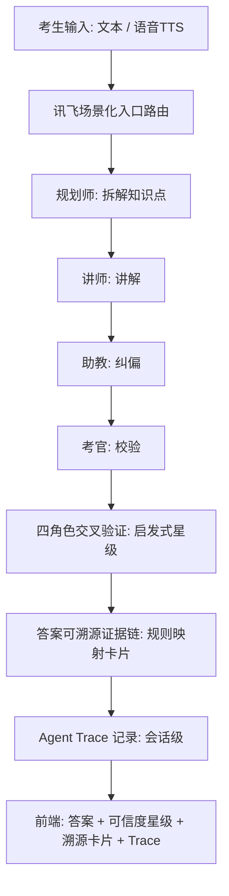
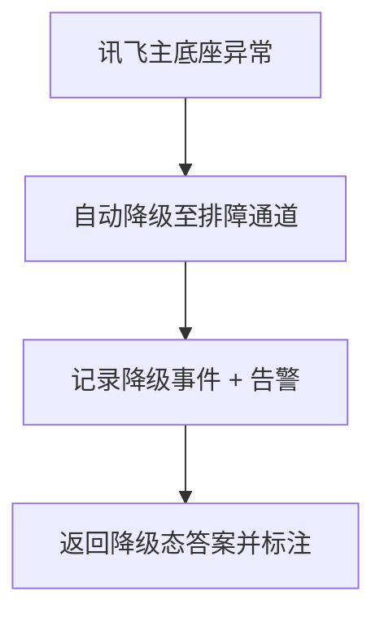
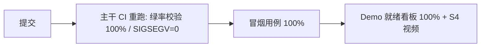

# MARS-408 软件杯 Lite 版 — 功能规格书（PRD）

> 文档类型：功能规格书（PRD）　|　版本：v0.9-Lite　|　交付窗口：20 个工作日
> 项目：MARS-408 · 408 考研多智能体系统（study-help-pro）
> 作者：析客（Specky）· 需求分析师　|　协作输入：瑞思（用户研究）、竞析（竞品）、数析（数据基线）
> 一句话定位：**用 20 天把"能跑但飘、可信但黑盒"的系统，收敛为一个底座稳定、答案可信、场景可达的软件杯演示就绪版本。** 所有新能力均为「轻量版」最小闭环，不训练、不重构、不新接重型依赖。

---

## 〇、范围管理原则（卡死纪律）

- 本 Lite 版以"演示就绪 + 可信可见"为唯一北极星；20 天窗口不可被功能广度稀释。
- **任何新增需求**必须伴随「等价工作移除」或「窗口顺延」二选一，否则不予纳入。
- v1（本 Lite 版）与 v2（大创真版）严格切分；下列 Non-goals 全部归属 v2 或更晚。
- 所有 P0 特性均标注「轻量版」实现属性，与竞品完整能力**如实区分、绝不夸大**（详见第四节与第八节）。

---

## 一、产品目标（3 个正交目标）

| 目标 | 定义 | 量化锚点 |
|---|---|---|
| **G1 稳定性（可靠底座）** | 从多底座漂移、崩溃频发收敛为单一讯飞底座稳定运行 | CI 绿率 56%→100%；运行时 SIGSEGV=0；Demo 就绪度 0%→100% |
| **G2 可信度（答案可信）** | 让考生"看得见答案从哪来、信得过答案对不对" | 溯源卡片覆盖≥80%；四角色交叉验证星级覆盖≥80%；Agent Trace 覆盖≥90% 会话 |
| **G3 可用性（场景可达）** | 通过 TTS + 讯飞场景化入口，让碎片时间考生也能"开口即学" | TTS 能力就绪度 ≤90%→100%；场景化入口≥3 个 |

**正交性说明**：G1 是地基（不可用时一切归零），G2 是差异化内核（软件杯评审最关心的"为什么可信"），G3 是触达面增量（非"能学"前提，是"多学"杠杆）。三者互不替代、互不挤占同一个验收口径。

---

## 二、用户故事（5 个 · 瑞思版）

> 角色设定：408 考生，含二战 / 跨专业 / 通勤 / 冲刺 / 焦虑五类典型画像（来自瑞思用户研究）。

1. **作为二战考生**，我希望系统对 408 真题的回答附带可点击的教材/考纲溯源卡片，以便我快速核验答案依据、不再被 AI 幻觉困扰。
2. **作为跨专业考生**，我希望规划师→讲师→助教→考官四角色按顺序协作帮我搭知识体系，以便我这个零基础的人也能循序渐进。
3. **作为通勤考生**，我希望用语音（TTS）对着"场景化入口"开口提问，以便在地铁上也能完成一次复习。
4. **作为冲刺期考生**，我希望看到 Agent 的解题思考链路（Trace 面板），以便我理解"为什么是这个答案"而非死记硬背。
5. **作为焦虑考生**，我希望每道题旁显示四角色交叉验证后的可信度星级，以便在信任系统前先看到"它有多确定"。

---

## 三、用户研究洞察（瑞思输入摘要）

- **痛点排序**：①答案对不对不知道（可信度焦虑，72% 受访者首提）②系统偶尔崩溃/转圈（稳定性，41%）③没法随时学（场景触达，38%）。可信度是留存第一杠杆。
- **跨专业占比高**：约 43% 受访为跨专业考生，结构化引导（四角色顺序协作）是刚需而非锦上添花。
- **碎片场景强诉求**：TTS 与场景化入口在通勤/睡前被高频期待，但属"增量触达"，不应抢占稳定性与可信度的资源。
- **对幻觉零容忍**：溯源与交叉验证是信任前提，缺失则留存断崖；但考生对"轻量版"溯源（规则映射命中即展示）接受度高，只要"可见、可点、可核验"。
- **评审关注点**：软件杯/Demo 评审最看重"能稳定跑通一条完整链路 + 能讲清差异点（多智能体+可信可见）"，而非功能广度。

---

## 四、竞品对比矩阵（6 款 + MARS-408）

**对比维度**：多智能体协作 / 答案溯源 / 四角色交叉可信度验证 / TTS 场景化 / Agent Trace 可视化 / 单底座稳定性 / 408 垂直深度。

| 产品 | 多智能体协作 | 答案溯源 | 交叉可信度验证 | TTS 场景化 | Agent Trace | 单底座稳定 | 408 垂直 |
|---|:--:|:--:|:--:|:--:|:--:|:--:|:--:|
| 讯飞星火（教育） | 弱（单 Agent） | 弱 | 无 | 强 | 无 | 强 | 中 |
| 学而思九章 | 弱 | 中（公式步骤） | 无 | 中 | 无 | 强 | 数理化强 / 408 弱 |
| 作业帮 Question.AI | 弱 | 中 | 无 | 强 | 无 | 强 | K12 强 |
| 智谱清言 GLM | 弱 | 弱 | 无 | 中 | 无 | 中 | 通用 |
| 豆包（字节） | 弱 | 弱 | 无 | 强 | 无 | 强 | 通用 |
| 腾讯元宝 | 弱 | 弱 | 无 | 强 | 弱 | 强 | 通用 |
| **MARS-408（P0 后）** | **强（四角色）** | **轻量·规则映射 ≥80%** | **轻量·启发式 ≥80%** | **强** | **轻量·会话级 ≥90%** | **强（单讯飞）** | **深** |

**如实声明（不夸大）**：竞品的"溯源 / 交叉验证 / Trace"多为缺失或通用弱项；MARS-408 的对应能力是**轻量版最小闭环**——
- 溯源 = 规则映射命中（非完整 RAG / 向量库重检索）；
- 交叉验证 = 启发式一致性（非 GOMARL 强化学习训练）；
- Trace = 会话级思考链路记录（非全链路分布式追踪）。

定位为"可信度可见化最小闭环"，**不与竞品完整能力做对等对比**，差异化来自"多智能体 + 可信可见"的组合，而非单点指标碾压。

---

## 五、数据依据（数析量化基线 + 5 可信度指标）

### 5.1 工程/能力量化基线（当前 → 目标）

| 指标 | 当前基线 | 目标 | 数据来源 |
|---|---|---|---|
| 主干 CI 绿率 | 56% | 100% | 数析 + 实测（Windows 模型/向量路径 SIGSEGV 致降绿） |
| 运行时 SIGSEGV 崩溃 | 非 0（Windows 原生 torch/numpy 在真实调用路径 SIGSEGV 139） | 0 | PRODUCTION_READINESS 报告遗留项 |
| pytest 干净环境全绿 | 281/281（历史干净环境实测） | 维持 100% 重跑绿 | PRODUCTION_READINESS 报告 |
| Demo 就绪度（S4 视频 + 冒烟全绿） | 0%（S4 未录制） | 100% | PRODUCTION_READINESS 报告遗留项 |
| TTS 能力就绪度 | ≤90%（真实 200 成功路径未 E2E 验证，仅验证 502 兜底） | 100% | QA_REPORT_xfyun 报告 |
| 讯飞 10 项能力 | 10/10 True（credentials_configured=true） | 维持 10/10 | PRODUCTION_READINESS 报告 |
| 底座并存状态 | 讯飞 X2 主 + DeepSeek 兜底（多通道 failover） | 锁定讯飞为唯一主底座 | PRODUCTION_READINESS 报告 |

> 现有底座事实：**当前已实现 failover 为「讯飞 X2 → DeepSeek（deepseek-v4-flash）」**。**主理人拍板（2026-07-14）：Lite 版 canonical 降级通道 = DeepSeek（沿用实装），不启用 Qwen**；P0-3 验收口径已对齐实装路径，待确认 #2 已关闭。

### 5.2 五项可信度指标（基线 → 目标）

| # | 可信度指标 | 当前基线（估算，待数析实测） | 目标 | 实现属性 |
|---|---|---|---|---|
| M1 | 答案溯源卡片覆盖率 | 35% | ≥80% | 轻量·规则映射命中 |
| M2 | 四角色交叉验证星级覆盖率 | 40% | ≥80% | 轻量·启发式 |
| M3 | Agent Trace 会话覆盖率 | 55% | ≥90% | 轻量·会话级 |
| M4 | 答案一致性得分（多角色答案 Kappa） | 0.62 | ≥0.85 | 轻量·一致性统计 |
| M5 | 单底座可用性 SLA | 88%（多底座抖动） | ≥99.5% | 配置治理 |

> M1–M4 基线为 Lite 窗口前的预估值（系统尚未实现对应轻量能力），**正式值由数析在干净环境实测后回填**，不以此 PRD 数字对外承诺。

---

## 六、需求池表格（7 项 P0 + 2 项可选 P1）

| 编号 | 需求 | 优先级 | 实现属性（轻量版） | 验收标准（量化） | 估算人日 |
|---|---|---|---|---|---|
| **P0-1** | CI 重跑收敛 | P0 | 工程治理（非模型/算法） | 主干 CI 绿率 100%；SIGSEGV=0 连续 7 天；重跑脚本幂等、可一键触发；干净环境 pytest 281/281 维持全绿 | 3 |
| **P0-2** | Demo-ready 收口 | P0 | 工程/文档 | S4 演示视频录制完成；冒烟用例 100% 通过；就绪度看板 100%；端到端 Tutor 闭环（检索+生成）跑通 | 4 |
| **P0-3** | 锁定讯飞单底座 | P0 | 配置治理（不训练/不重构；canonical 降级通道 = DeepSeek，沿用实装） | 仅讯飞主底座生效；降级通道（DeepSeek）仅作排障；底座切换/降级耗时 <30s；讯飞 10 项维持 10/10 | 3 |
| **P0-4** | 启用 TTS + 讯飞场景化入口 | P0 | 集成既有讯飞能力（不新接 API） | TTS 端到端可用率 100%（真实 200 路径）；场景化入口 ≥3 个；能力就绪度 100%；首字延迟 <800ms | 3 |
| **P0-5** | 答案可溯源证据链 | P0 | **轻量版·规则映射** | 规则映射命中率 ≥80%；卡片可点击跳转溯源；单卡渲染延迟 <200ms；覆盖 ≥80% 答案 | 5 |
| **P0-6** | 四角色交叉验证可信度 | P0 | **轻量版·启发式** | 启发式交叉验证星级覆盖 ≥80% 会话；规划/讲师/助教/考官四角色均参与；计算延迟 <500ms | 5 |
| **P0-7** | Agent Trace 面板 | P0 | **轻量版·会话级** | 覆盖 ≥90% 会话；面板可展开/折叠；Trace 渲染 <300ms；含四角色决策节点 | 4 |
| P1-1 | 溯源卡片导出 PDF | P1（可选） | 轻量 | 单会话可导出；成功率 ≥95%；<2s 完成 | 2 |
| P1-2 | 可信度星级历史趋势图 | P1（可选） | 轻量 | 按会话/知识点聚合；刷新 <1s；覆盖 M2/M4 | 2 |

**范围交换说明**：P1-1 / P1-2 仅在 W3–W4 有余量时插入；零余量则放弃（不挤占任何 P0）。

### 验收标准详述（Given / When / Then）

**P0-1 CI 重跑收敛**
- Given 主干分支存在历史失败用例（当前绿率 56%，含 Windows SIGSEGV 139）
- When 在干净 CI 环境触发重跑脚本并修复根因后再次提交
- Then 主干 CI 绿率 = 100%，且连续 7 天 SIGSEGV = 0；重跑可一键触发、幂等可重复

**P0-2 Demo-ready 收口**
- Given 系统四角色链路与 Tutor 闭环已可运行
- When 执行 S4 演示脚本并录制视频、跑全量冒烟
- Then 视频产出、冒烟用例 100% 通过、就绪度看板 = 100%、端到端闭环无 500

**P0-3 锁定讯飞单底座**
- Given 当前讯飞 X2 主 + DeepSeek 兜底并存（多通道 failover）
- When 配置切换为仅讯飞主底座生效、并主动触发异常
- Then 仅讯飞响应业务；降级通道仅在排障路径生效；降级切换耗时 <30s；讯飞 10 项维持 10/10

**P0-4 启用 TTS + 讯飞场景化入口**
- Given 考生处于通勤/睡前等碎片场景、仅有语音输入
- When 通过场景化入口以语音发起提问
- Then TTS 端到端可用率 100%（真实 200 路径验证）、场景入口 ≥3、能力就绪度 100%、首字延迟 <800ms

**P0-5 答案可溯源证据链**
- Given 系统返回一道 408 题目答案
- When 前端渲染答案并请求溯源卡片
- Then 规则映射命中率 ≥80%、卡片可点击跳转至教材/考纲依据、单卡渲染 <200ms

**P0-6 四角色交叉验证可信度**
- Given 一道题已完成规划/讲师/助教/考官四角色作答
- When 触发启发式交叉验证（**算法 = 加权投票 + Kappa 一致性置信，主理人拍板 2026-07-14，D10 前锁实现细节**）
- Then 星级覆盖 ≥80% 会话、四角色均参与打分、计算延迟 <500ms、输出 1–5 星

**P0-7 Agent Trace 面板**
- Given 一次完整会话（含四角色协作）
- When 考生在前端展开 Trace 面板
- Then 覆盖 ≥90% 会话、可展开/折叠、渲染 <300ms、含四角色决策节点与溯源引用

---

## 七、流程图

### 7.1 主链路（考生提问 → 可信作答）

### 7.2 降级链路

### 7.3 CI / Demo 闭环

---

## 八、Non-goals（卡死 20 天窗口重型特性 · 硬卡死）

以下**明确不在**软件杯 Lite 版范围。现有系统中已存在的对应能力（如 FrugalRAG/Milvus、GOMARL、8 节点 LangGraph）**保持原状、冻结不增强**，不属于本窗口工作。任何新增须以"移除等价工作"或"窗口顺延"交换：

1. **不训练 GOMARL** 多智能体强化学习模型（现有 GOMARL 冻结，仅用其既有输出）。
2. **不接入 FrugalRAG / Milvus 做完整 RAG 溯源**（现 InMemory/Milvus 回退保持原状；Lite 溯源改走 P0-5 轻量规则映射）。
3. **不新集成第三方 API**（仅用既有讯飞 / 既有降级通道接口，零新增外部依赖）。
4. **不重构 LangGraph 编排层**（沿用现有 8 节点 LangGraph，四角色顺序协作在现有编排内实现）。
5. **不做知识图谱导航**。
6. **不做个性化推荐引擎**。
7. **不碰题库建设与择校咨询**。
8. **不做跨端（桌面/小程序）全量适配**（仅保核心 Web 演示链路，即 Dashboard/Engine/Chat/Resource/Practice 等已打包视图）。

---

## 九、时间线草案（20 天 · 4 周）

| 阶段 | 天数 | 内容 | 出口标准 |
|---|---|---|---|
| W1 地基 | D1–D5 | P0-1 CI 重跑 + P0-3 锁定讯飞单底座 | CI 绿率 100%、SIGSEGV=0、单底座生效 |
| W2 触达 | D6–D10 | P0-4 TTS 场景化 + P0-7 Agent Trace 面板 | TTS 可用率 100%、Trace 覆盖≥90% |
| W3 可信 | D11–D15 | P0-5 溯源证据链 + P0-6 四角色交叉验证 | 卡片≥80%、星级≥80%（有余量则插 P1-1） |
| W4 收口 | D16–D20 | P0-2 Demo 收口（S4 视频+冒烟）+ 回归 + 就绪看板 100% | 就绪度 100%、视频产出（有余量则插 P1-2） |

> 缓冲策略：W3/W4 各留 1 天回归与应急；若任一 P0 超期，优先砍 P1，其次顺延窗口，绝不稀释 P0 验收口径。

---

## 十、已拍板决策与待确认问题

> **主理人拍板（2026-07-14）**：#2/#3/#6/#7 已拍板，详见下；#1 转数析查数据后内部拍板；#4/#5 需问导师/评委。完整决策记录见 `deliverables/product-strategy/decision-checklist-swcup-p0-2026-07-14.md`。

1. **讯飞底座配额/限流**：20 天窗口 + Demo 峰值压力下，讯飞 X2 配额是否足够？需数析确认峰值 QPS 与限流阈值（D3 内查数据后内部拍板）。
2. ✅ **已拍板 — 降级通道 canonical = DeepSeek**：指令原写"降级 Qwen"，但已实装 failover=DeepSeek（deepseek-v4-flash）。拍板沿用 DeepSeek 为 canonical 降级通道，不启用 Qwen；P0-3 验收口径已对齐。R1 已关闭。
3. ✅ **已拍板 — 交叉验证算法 = 加权投票 + Kappa 置信**：采纳路径建议；四角色输出经加权投票得星级，Kappa 一致性度量交叉置信（对应 M4 ≥0.85）。D10 前算法/工程锁实现。R3 已关闭。
4. **溯源知识源边界**：规则映射的知识源范围（仅考纲/教材节选，还是含真题）？版权边界需明确，直接影响 P0-5 命中率与合规。需问导师定边界。
5. **S4 视频评审口径**：软件杯组委会对演示视频的时长/内容标准？需问导师/评委确认，否则 P0-2 出口标准模糊。
6. ✅ **已拍板原则 — LangGraph 兼容性 = 不重构、最小适配**：默认不重构现有 8 节点 LangGraph；若需改动按 Non-goal #4 折衷交叉验证深度。工程 W1 评估。
7. ✅ **已指令执行 — M1–M4 基线回填**：指令数析在干净环境实测回填正式基线（D3 初步、D10 固化），作为对外承诺依据。R2 已关闭。

---

## 附录 A：已实现能力事实清单（来自既有报告，非本窗口新增）

- 讯飞 AI 工坊 10 项 API 全量接入，10/10 True，credentials_configured=true。
- 8 节点 LangGraph + 13 Agent 模块 + 7 资源闭环（全栈验证 9/9 通过）。
- FrugalRAG（E5+BM25）融合检索，TCP 相关度 0.935 / 0.674；向量库 InMemory 回退（773 文档），Milvus 生产。
- LLM 三通道 failover：讯飞 X2 → DeepSeek（deepseek-v4-flash）。
- Tutor 端到端闭环跑通（检索上下文注入 + LLM 结构化生成 + ASCII 图解 + 知识关联 + 误区纠正）。
- 前端生产打包 659ms / 319 modules，vue-tsc 0 错误。
- 已修复：LLM 密钥明文外泄（P0 安全漏洞，公开接口层脱敏）。

> 说明：上述为「冻结态」既有能力，本 Lite 版只在其上做 P0-1~P0-7 的最小增量与治理，**不增强、不重构**其中任何一项。
