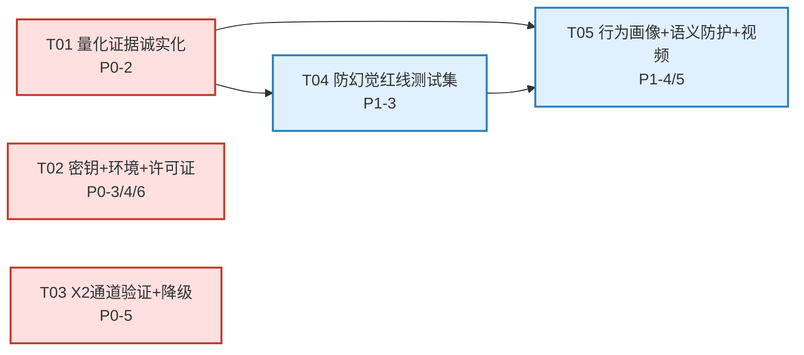

# NetLearn A3 执行阶段 · 增量系统设计 + 有序任务列表

> 架构师：高见远（software-architect）
> 日期：2026-07-19
> 范围：将「中国软件杯 A3 竞争力审计」P0/P1 清单转为可执行代码与文档（跳过演示视频）
> 基线：所有结论附真实文件路径/行号；benchmark 实测数据来自 `py-server/experiments/results/benchmark_2026-07-19.json`（已跑通）

---

## Part A · 实现方案概要（增量）

本阶段为既有系统的**证据补全 + 合规收敛 + 防御性增强**，不重写架构。改动分三类：

### 1. 文档/证据类（P0-2 / P0-4 / P0-6 / P1-3）
- **量化证据诚实化**：benchmark 已于 2026-07-19 跑通（`experiments/results/benchmark_2026-07-19.json`，2083 chunks，28 查询×2 方法 + 30 题×3 trial×2 方法）。**实测结论与宣称相反**——须据实回填，详见 §1.1。
- **评测环境固化**：新增 `EVALUATION_ENV.md`，固化「Linux 容器 / 预编译 wheel」要求，规避 Windows torch/numpy SIGSEGV（`pyproject.toml:44` 的 `segv_env` marker 已存在）。
- **开源许可证副本**：`docs/licenses/` 目录不存在（已核实），须补齐或修正 `OPENSOURCE_LICENSES.md` 声称。
- **防幻觉红线测试集**：基于 `evidence_check.py` + `safety.py` + `prompt_guard.py` 设计 408 易错点测试集 + 报告骨架。

### 2. 配置/合规类（P0-3 / P0-5）
- **密钥治理**：`py-server/.env` 含真实密钥（DEEPSEEK/XF/TAVILY/AUTH_SECRET 共 16 项）；`.gitignore:26-27` 已排除 `.env`，`.env.example` 已存在但缺 `ADMIN_PASSWORD`/`LOG_LEVEL`。提交包须确保 `.env` 不入包、`config.json` 凭证字段为空（已确认 `config.json:3-14` 全空）。
- **X2 通道**：`llm_provider.py:74,191` 讯飞 X2 第一优先级 → DeepSeek 兜底；X2 需 `api_password`（APIPassword Bearer，`:332-345`），否则 401/500。须验证通道并备降级话术文档。

### 3. 代码增强类（P1-4 / P1-5）
- **行为驱动画像**：新增 `behavior_tracker.py` + `student_behavior_events` 表 + `/api/profile/behavior` 接口，在 `/chat` 与资源生成后轻量回写画像（当前 `api/profile.py` 仅构建流回写，`api/chat.py` 不回写）。
- **语义级注入防护**：新增 `shared/semantic_guard.py`，在 `prompt_guard.py` 句法级之上叠加 LLM 意图分类层（`prompt_guard.py:7-9` 自陈为句法级）。
- **视频接入主流程**：`video_script.py` 仅生成文本脚本；`xfyun_services.generate_video:371` 真数字人视频在独立路径。新增 `media_generator.generate_real_video`，在 `generator_cluster` 内 try/except 非阻塞接入（仿 `ppt_builder` 模式 `generator_cluster.py:116-127`）。

### 1.1 量化证据诚实化（关键，P0-2）

benchmark 已跑通，**实测数据直接证伪「成本降 45% / 准确率升 13% / GOMARL 升 15%」**：

| 宣称 | 实测（benchmark_2026-07-19.json） | 诚实处置 |
|------|----------------------------------|---------|
| 检索成本降 45% | token_reduction_pct = **-0.14%**（FrugalRAG 173.46 vs 全量 173.21，基本持平）；latency_reduction_pct = **-5.28%**（FrugalRAG 反而慢 5.3%，因多路融合开销） | **删除「降 45%」**，改为「检索质量提升，token 成本基本持平」 |
| 准确率升 13% | 检索质量：Recall@5 Δ=+0.8036（FrugalRAG 2.7351 vs 1.9315，相对 +41.6%）；MRR Δ=+0.0964（0.6976 vs 0.6012，相对 +16.0%） | 改为「Recall@5 提升 41.6%、MRR 提升 16.0%（28 查询小样本）」 |
| GOMARL 升 15% | NeuralMixer 准确率 0.6778 **低于** 加权投票 0.7667（Δ=-0.0889，低 8.9pp）；Kappa(NM↔真值)=0.569 < Kappa(投票↔真值)=0.688 | **删除「升 15%」**，改为「NeuralMixer 共识方差更低（std 0.353 vs 0.659，更稳定），但当前合成弱标注集上准确率未超加权投票；为初步 benchmark」 |

> ⚠️ benchmark 的 `mean_recall@5` 绝对值（2.7351/1.9315）超出 [0,1] 区间，疑 `compute_recall_at_k` 统计口径有误（见 §6 待明确）。**文档回填时只引用 delta 与相对提升，不引用该绝对值**，由工程师 T01 复核。

已有改写清单 `documents/R6-文档诚实化改写清单-执行版.md` 覆盖技术方案/PPT/视频脚本三文档；本阶段须按实测数据**定稿回填**，并扩展到 `申报书内容.txt`、`研究报告.md`、`合规清单.md` 等其余含数字文档（grep 命中 20+ 文件）。

---

## Part B · 有序任务列表

> 约束说明：本阶段为增量修复，无新项目基础设施（无新 package.json/vite.config）。T01 为「证据/文档基础」，是其余文档修订与代码诚实边界的前置依赖，对应角色规则中「首任务=基础设施」的等价映射。

### T01 · 量化证据诚实化 + benchmark 报告定稿（P0-2）

| 字段 | 内容 |
|------|------|
| 类型 | 文档 |
| 涉及文件 | `py-server/experiments/results/benchmark_2026-07-19.json`(读)、`documents/R6-文档诚实化改写清单-执行版.md`(更新定稿)、`documents/技术方案说明书-特等奖版.md`、`documents/答辩PPT大纲-特等奖版.md`、`documents/演示视频脚本-特等奖版.md`、`documents/申报书内容.txt`、`documents/基于改进GoMARL与FrugalRAG的408考研个性化学习多智能体系统研究报告.md`、`documents/软件杯赛题合规清单.md`、`documents/双线路线图.md`、`documents/产品需求文档PRD.md`、`submission/02_配套文档/*`(同步)、`deliverables/audit_tech_architecture_2026-07-19.md`(附录补实测) |
| 实现步骤 | 1) 复核 `compute_recall_at_k`（`experiments/benchmark.py:94-102`）统计口径，若确认 bug 则修复并重跑 `python experiments/benchmark.py` 生成新 results；2) 据 `benchmark_2026-07-19.json` 的 summary.deltas 定稿诚实文案：检索「token 持平/延迟略增/Recall@5 与 MRR 提升」、GOMARL「NeuralMixer 共识更稳但准确率未超加权投票（合成弱标注，初步 benchmark）」；3) 按 `R6-文档诚实化改写清单` 序号 8/9/13 等，将 45%/13%/15%/Kappa≥0.85 全部替换为实测或「以实测为准」；4) grep 全仓 `45%\|13%\|15%\|Kappa.*0.85` 确认无遗漏，同步 `submission/02_配套文档/`；5) 新增 `documents/量化创新实测报告-2026-07-19.md`（实验设置/数据/图/诚实结论）。 |
| 依赖任务 | 无（benchmark 已跑通） |
| 优先级 | P0 |
| 验收标准 | ① 全仓无未实证的 45%/13%/15%/Kappa≥0.85 字样；② 实测报告含实验设置+原始 JSON 引用+fig_cost.png/fig_mixer.png；③ R6 清单每条标注「已定稿」；④ submission/ 与 documents/ 一致。 |

### T02 · 密钥治理 + 评测环境说明 + 开源许可证副本（P0-3 / P0-4 / P0-6）

| 字段 | 内容 |
|------|------|
| 类型 | 配置 + 文档 |
| 涉及文件 | `py-server/.env`(清理)、`py-server/.env.example`(补全)、`py-server/config.json`(核实空凭证)、`.gitignore`(核实)、`EVALUATION_ENV.md`(新建)、`INSTALL.md`(补充链接)、`documents/OPENSOURCE_LICENSES.md`(核实/修正)、`docs/licenses/`(新建目录+副本)、`submission/04_源码/`(核实不含 .env)、`Dockerfile`、`docker-compose.yml` |
| 实现步骤 | **P0-3**：1) 确认 `.gitignore:26-27` 已排除 `.env`/`py-server/.env`；2) `.env.example` 补 `ADMIN_PASSWORD=` 与 `LOG_LEVEL=INFO`（当前缺，对比 `.env` 16 项 vs `.env.example` 14 项）；3) 核实 `config.json:3-47` 凭证字段全空（已确认）；4) 打包前确认 `submission/04_源码/` 不含 `.env`，仅留 `.env.example`；5) `AUTH_SECRET` 生产用随机值（`Dockerfile:39` `NETLEARN_ENV=production` 已 fail-fast）。**P0-4**：6) 新建 `EVALUATION_ENV.md`：明确「评测/CI 须在 Linux 容器或预编译 wheel 环境运行 pytest，Windows 原生 torch/numpy 可能 SIGSEGV（pyproject.toml:44 segv_env marker）」；给出 `docker compose run` 与 `pip install --index-url 预编译源` 两条路径；7) `INSTALL.md` 顶部加「⚠️ 评委评测请优先阅读 EVALUATION_ENV.md」链接。**P0-6**：8) 核实 `docs/licenses/` 不存在（已确认），创建目录；9) 为关键依赖（fastapi/langgraph/pymilvus/sentence-transformers/httpx/uvicorn/python-docx/matplotlib/sklearn 等）放置 LICENSE 副本，或修正 `OPENSOURCE_LICENSES.md` 声称为「许可证信息见本文件清单，副本按需向各上游仓库获取」。 |
| 依赖任务 | 无 |
| 优先级 | P0 |
| 验收标准 | ① `submission/04_源码/` 无 `.env`，仅有 `.env.example`（含全部 16 项占位）；② `config.json` 凭证全空；③ `EVALUATION_ENV.md` 存在且含 Linux 容器/预编译 wheel 双路径；④ `docs/licenses/` 存在且含 ≥10 个 LICENSE 副本，或 `OPENSOURCE_LICENSES.md` 声称已修正与实际一致。 |

### T03 · 讯飞 X2 通道验证 + DeepSeek 降级话术（P0-5）

| 字段 | 内容 |
|------|------|
| 类型 | 文档 + 验证脚本 |
| 涉及文件 | `py-server/db/llm_provider.py`(读 `:74,191,321-359`)、`py-server/.env`(XF_API_PASSWORD)、`py-server/api/xfyun.py`(读 status)、`documents/讯飞X2通道验证与降级话术-2026-07-19.md`(新建)、`documents/演示日应急卡.md`(补充) |
| 实现步骤 | 1) 用提交账号实跑 `LLMProvider(provider_name="xfyun").chat([{"role":"user","content":"ping"}])`，确认 `api_password`（APIPassword Bearer）生效；2) 若 401/500，记录 `llm_provider.py:351-353` 日志的 HTTP code/body，确认自动回退 DeepSeek（`:74,86-91`）；3) 撰写验证文档：通道状态表（X2 可用/不可用两态）+ DeepSeek 降级演示话术（「讯飞星火 X2 为赛题合规主通道，本次因账号权限/网络降级至 DeepSeek，三通道 failover 已在 `llm_provider.py` 实现，功能不受影响」）+ 截图占位；4) `演示日应急卡.md` 补「X2 降级」一条。 |
| 依赖任务 | 无 |
| 优先级 | P0 |
| 验收标准 | ① 验证文档含两态结论（X2 可用 / 不可用）+ 对应演示话术；② 话术明确「failover 已实现，非功能缺失」；③ 若 X2 不可用，`.env` 的 `XF_API_PASSWORD` 问题已记录且 DeepSeek 通道确认可用。 |

### T04 · 防幻觉/内容安全验证报告 + 红线测试集（P1-3）

| 字段 | 内容 |
|------|------|
| 类型 | 测试设计 + 报告 |
| 涉及文件 | `py-server/agents/evidence_check.py`(读 `:129-175`)、`py-server/utils/safety.py`(读 `:55-82,106-113`)、`py-server/shared/prompt_guard.py`(读 `:22-75`)、`py-server/tests/test_safety_redline.py`(新建)、`py-server/config/sensitive_words.json`(读)、`documents/防幻觉与内容安全验证报告-2026-07-19.md`(新建) |
| 实现步骤 | 1) 设计红线测试集（≥30 例，三类）：① 注入红线（`ignore previous instructions`/`system:`/`jailbreak`/角色伪造/提示词泄露，断言 `sanitize_user_input` 中和 + `ANTI_INJECTION_INSTRUCTION` 追加）；② 知识性幻觉红线（`safety.py:55-60` 的 HTTP443/TCP无连接/交换机网络层/TCP三次 四类，断言 `check_hallucination` 命中 + 正确提示）；③ 证据冲突红线（构造 teacher/quiz 内容矛盾对，断言 `evidence_check_node` 检出 conflict 且 `disposition` 非 adopt）；2) `test_safety_redline.py` 用 pytest marker `unit`，纯函数无 LLM 依赖（注入/幻觉部分）；证据冲突部分 mock `conflict_engine`；3) 跑通生成通过率骨架报告：含测试集设计表、通过率、失败案例分析、与 `evidence_check.py:169-173` 降级一致性说明；4) 报告标注「语义级注入防护见 P1-5① 增强方案」。 |
| 依赖任务 | T01（诚实边界口径一致） |
| 优先级 | P1 |
| 验收标准 | ① `test_safety_redline.py` ≥30 例可跑通（Linux 容器），注入/幻觉红线通过率 100%；② 报告含三类测试设计+通过率+降级说明；③ 报告诚实标注「当前注入防护为句法级，语义级增强进行中（P1-5①）」。 |

### T05 · 行为驱动画像 + 语义级注入防护 + 视频接入主流程（P1-4 / P1-5）

| 字段 | 内容 |
|------|------|
| 类型 | 代码 |
| 涉及文件 | `py-server/agents/behavior_tracker.py`(新建)、`py-server/shared/semantic_guard.py`(新建)、`py-server/agents/media_generator.py`(扩展)、`py-server/agents/generator_cluster.py`(扩展 `:85-96,113`)、`py-server/agents/state.py`(扩展)、`py-server/agents/video_script.py`(读)、`py-server/db/xfyun_services.py`(读 `:371`)、`py-server/db/pg_client.py`(扩展 `:196-225`)、`py-server/api/profile.py`(扩展)、`py-server/api/chat.py`(扩展 `:53-56`)、`py-server/api/agents.py`(扩展)、`py-server/models.py`(扩展)、`src/views/ChatView.vue`/`ResourceView.vue`(行为上报)、`documents/行为画像与安全增强设计-2026-07-19.md`(新建) |
| 实现步骤 | **P1-4**：1) 新建 `behavior_tracker.py`：`BehaviorEvent` dataclass + `update_profile_from_behavior(profile_id, events)` 轻量更新（dwell>阈值→weak_points、reattempt→优先级、resource_click→interest_area）；2) `pg_client.py` 加 `student_behavior_events` 表（user_id/event_type/topic/duration_ms/resource_type/ts）+ `update_profile_partial(profile_id, partial)` 合并；3) `api/profile.py` 加 `POST /profile/behavior` 接口；4) `api/chat.py:53` chat_send 成功后 fire-and-forget 调 `update_profile_from_behavior`；`api/agents.py` 资源生成后从 `mindmap.weak_points` 回写。**P1-5①**：5) 新建 `semantic_guard.py`：`async classify_intent(text, llm) -> IntentVerdict{is_injection,confidence,reason}`（few-shot LLM 分类：instruction_override/role_fabrication/data_exfiltration/benign）；6) 在 `llm_provider._sanitize_messages` 后按采样/句法命中时调用，超时/失败降级为仅句法；7) 输出侧可选复用 `xfyun_services.check_compliance:503`。**P1-5②**：8) `media_generator.py` 加 `async generate_real_video(topic, script, profile) -> dict`（调 `xfyun_services.generate_video`，失败降级返回脚本）；9) `generator_cluster.py` 在 `video_script` 写回后（`:113`）try/except 非阻塞调 `generate_real_video`，结果写 `state["video_file"]`（仿 `ppt_builder:116-127`）；10) `state.py` 加 `video_file: Optional[dict]`。 |
| 依赖任务 | T01（诚实边界）、T04（安全报告口径） |
| 优先级 | P1 |
| 验收标准 | ① `/profile/behavior` 可接收事件并更新画像 weak_points（单测）；② `semantic_guard.classify_intent` 对 `ignore previous instructions` 判 is_injection=True（单测，mock LLM）；③ `generator_cluster` 生成后 `state["video_file"]` 在 X2 凭证可用时为真实链接、不可用时为 None 且不中断（仿 ppt_builder 降级）；④ 设计文档含类图/时序图。 |

---

## Part C · P1-4 / P1-5 具体设计方案

### P1-4 行为驱动画像 — 数据结构与接口

**新增数据结构：**

```python
# py-server/agents/behavior_tracker.py
from dataclasses import dataclass
from typing import Literal

@dataclass
class BehaviorEvent:
    user_id: str
    event_type: Literal["dwell", "reattempt", "resource_click"]  # 停留/重答/资源点击
    topic: str
    duration_ms: int = 0          # dwell 专用
    resource_type: str = ""       # resource_click 专用: teacher/quiz/ppt/...
    timestamp: str = ""           # ISO8601

# 画像扩展字段（合并进既有 8 维 profile，不改 schema 顶层）
# profile["behavior_signals"] = {
#     "dwell_topics": {topic: avg_ms},      # 停留时长 Top
#     "reattempt_topics": [topic],          # 重答知识点
#     "hot_topics": [topic],                # 高频点击
#     "last_active": "ISO8601"
# }
```

**接口签名：**

```python
# pg_client.py 新增
def log_behavior_event(self, event: BehaviorEvent) -> None: ...
def update_profile_partial(self, profile_id: str, partial: dict) -> dict:
    """合并 partial 到既有 profile（深合并 behavior_signals），写回 student_profiles。"""

# behavior_tracker.py 新增
async def update_profile_from_behavior(profile_id: str, events: list[BehaviorEvent]) -> dict:
    """轻量规则：dwell_avg > 60s 的 topic → 加入 weak_points；
    reattempt ≥2 次 → weak_points 置顶；resource_click 频次 → interest_area。
    返回更新后 profile。调用 pg_client.update_profile_partial。"""

# api/profile.py 新增
@router.post("/behavior")
async def report_behavior(req: BehaviorReportRequest, user=Depends(get_current_user)):
    """前端上报行为事件，fire-and-forget 更新画像。"""
```

**与现有模块集成点：**
- `api/chat.py:53-56` chat_send 成功返回前，`asyncio.create_task(update_profile_from_behavior(user["id"], [BehaviorEvent(...)]))`（不阻塞响应）。
- `api/agents.py` 资源生成完成后，从 `state["mindmap"]["weak_points"]` 提取并 `update_profile_partial`（与 `LearningPathView.vue:97-104` 的 progress 回写并行，不冲突——progress 是既有维度，behavior_signals 是新增维度）。
- 画像 8 维 `completed` 判定（`profile.py:59-60`）不变；behavior_signals 为增强信号，不影响 completed 计算。

### P1-5① 语义级注入防护 — 接口与分层

```python
# py-server/shared/semantic_guard.py
from dataclasses import dataclass

@dataclass
class IntentVerdict:
    is_injection: bool
    confidence: float          # 0-1
    reason: str                # instruction_override / role_fabrication / data_exfiltration / benign
    raw: str = ""

async def classify_intent(text: str, llm) -> IntentVerdict:
    """LLM 意图分类（few-shot）。超时/失败返回 IntentVerdict(False,0,'unknown')，
    降级为仅句法防护（prompt_guard 已处理）。"""

def should_run_semantic_check(text: str) -> bool:
    """采样+句法命中触发：句法 guard 命中标记 / 长度异常 / 随机 10% 采样。
    控制成本，避免每条都过 LLM。"""
```

**集成点：** `llm_provider._sanitize_messages`（`:201-213`）在句法 `sanitize_user_input` 后，若 `should_run_semantic_check` 为真则 `await classify_intent`，is_injection=True 时追加更强系统约束或拒绝。输出侧可选 `xfyun_services.check_compliance`（`xfyun_services.py:503`）做内容安全审计。

### P1-5② 视频接入主流程 — 接口

```python
# py-server/agents/media_generator.py 扩展
async def generate_real_video(topic: str, script: str, profile: dict) -> dict:
    """调 xfyun_services.generate_video(prompt=script[:2000]) 生成数字人视频。
    成功返回 {ok:True, video_url, audio_url, task_id}；
    失败/无凭证返回 {ok:False, fallback:"script", script}（降级为脚本，不抛异常）。"""
```

**集成点：** `generator_cluster.py` 在 `state["video_script"] = video_script`（`:113`）后，try/except 调 `generate_real_video`，写 `state["video_file"]`。`state.py` 加 `video_file: Optional[dict]`。非阻塞，仿 `ppt_builder`（`:116-127`）。

### 类图（P1-4 / P1-5 核心类关系）

见 `docs/class-diagram.mermaid`。

### 时序图（行为画像回写 + 视频生成主流程）

见 `docs/sequence-diagram.mermaid`。

---

## Part D · 依赖包列表（新增）

本阶段主要为文档/配置，代码增强复用现有依赖，**无新增第三方包**：

- `semantic_guard.classify_intent` 复用既有 `LLMProvider`（httpx/langgraph 已在 `pyproject.toml:8-11`）。
- `behavior_tracker` 纯 Python + 既有 `psycopg2-binary`（`pyproject.toml:17`）/ `pg_client`。
- `generate_real_video` 复用既有 `xfyun_services`（httpx 已在 `pyproject.toml:9`）。
- 红线测试复用 `pytest`/`pytest-asyncio`（`pyproject.toml:25-26`）+ `respx`（test 可选依赖 `pyproject.toml:32`）mock HTTP。

> benchmark 重跑（T01 若需修复 recall 统计）依赖 `scikit-learn`（`benchmark.py:46` 已用 `cohen_kappa_score`）与 `matplotlib`（`pyproject.toml:12`）。若环境缺 sklearn，T01 须在 `[test]` 可选依赖补 `scikit-learn>=1.3`。

---

## Part E · 共享知识（给工程师寇豆码的跨文件约定）

1. **诚实口径统一**：所有文档数字须与 `benchmark_2026-07-19.json` 实测一致；「降 45%/升 13%/升 15%」已证伪，一律改为实测或「以实测为准」。R6 清单为权威改写依据。
2. **降级不中断原则**：新增代码（视频/行为/语义防护）一律 try/except 降级，**绝不中断 LangGraph 主链路**（与 `evidence_check.py:169-173`、`ppt_builder` `generator_cluster.py:125-127` 一致）。
3. **凭证安全**：`get_provider_info()`（`llm_provider.py:152-173`）已掩码；新代码不得明文日志密钥；`.env` 不入提交包。
4. **画像 schema 兼容**：behavior_signals 为新增子字段，深合并进既有 profile dict；不改 `profile.py:54-60` 的 8 维 `completed` 判定。
5. **state 扩展只增不删**：`state.py` 新增 `video_file` 字段为 Optional，旧调用方不读不报错。
6. **测试 marker**：红线测试用 `@pytest.mark.unit`（无 LLM/无网络）；涉及 torch 的测试用 `segv_env` marker（`pyproject.toml:44`），Linux 容器跑、Windows 跳过。
7. **submission 同步**：documents/ 与 submission/02_配套文档/ 须双写一致，T01 改完一处即同步另一处。

---

## Part F · 待明确事项（需主理人/用户决策）

1. **benchmark recall 统计口径**：`mean_recall@5` 绝对值 2.7351/1.9315 超出 [0,1]，疑 `compute_recall_at_k`（`benchmark.py:94-102`）按多 subject 累加而非 binary。需工程师复核：若 bug，修后重跑再回填文档；若为多 subject 求和口径，文档须注明定义。**当前回填只用 delta + 相对提升，不引绝对值。**
2. **X2 账号权限**：提交/演示账号是否已开通星火 X2（spark-api-open）APIPassword？若未开通，T03 降级话术为定稿方案；若已开通，须实跑确认。需用户提供账号或确认。
3. **知识库规模**：benchmark meta 显示 2083 chunks，但产品审计称 620 chunks（`netlearn_kb.json` 3.4MB）。向量库 `vectordb_data` 可能已扩容。文档「620 chunks」表述（R6 序号 15）须以代码实际 `store.count()` 为准统一。需确认以哪个为准。
4. **licenses 副本策略**：补齐完整 LICENSE 副本（≥10 文件）vs 修正 `OPENSOURCE_LICENSES.md` 声称为「信息清单制」——前者更合规但耗时，后者更轻。建议前者（NF2 硬合规），需主理人确认。
5. **语义级防护成本**：`classify_intent` 每次过 LLM 有成本/延迟。采样率（建议句法命中+10% 随机）是否可接受？若评委关注安全可提高采样率。
6. **行为画像存储**：`student_behavior_events` 表用既有 PostgreSQL（`pg_client.py`）还是 Redis（轻量事件流）？建议 PG 持久化 + Redis 可选缓存，需确认 PG 在评测环境可用。

---

## 任务依赖图



> T01/T02/T03 为 P0，可并行启动；T04 依赖 T01（诚实口径）；T05 依赖 T01+T04（安全/诚实边界）。
