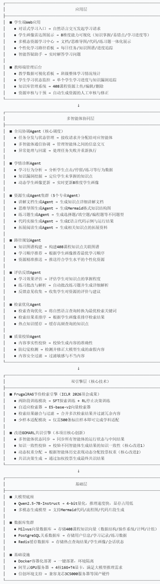
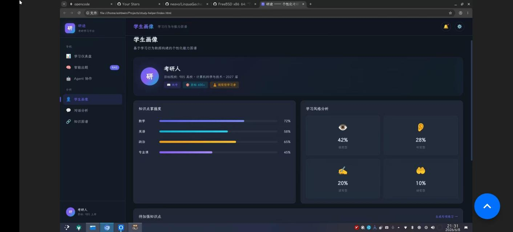
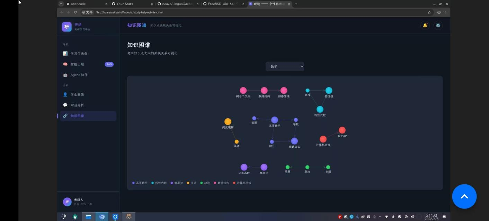

# MARS-408 开发说明书

> 第十五届中国软件杯 A3 赛题
> 基于大模型的个性化资源生成与学习多智能体系统开发
> 团队：张敏杰(负责人)、陈健伟、彭凯扬、张文杰、张勋
> 闽江大学网络空间安全学院
> 版本：v2.0 | 2026-07-20

---

## 目录

1. [需求分析](#一需求分析)
2. [项目概述](#二项目概述)
3. [开源声明](#三开源声明)
4. [系统架构](#四系统架构)
5. [智能体设计](#五智能体设计)
6. [核心模块说明](#六核心模块说明)
7. [开发环境搭建](#七开发环境搭建)
8. [API 接口说明](#八api-接口说明)
9. [关键算法说明](#九关键算法说明)
10. [测试说明](#十测试说明)

---

## 一、需求分析

### 1.1 新时代大学生学习需求分析

计算机 408 考研（数据结构、计算机网络、计算机组成原理、操作系统四门专业课）每年有数十万考生参与，但当前备考生态存在以下核心痛点：

**个性化缺失**：传统网课和教材按统一进度授课，无法根据每个学生的知识基础、薄弱点、学习风格进行差异化教学。跨专业考生、在职考生、二战考生等不同群体的学习起点差异巨大，同一套资源无法满足所有需求。

**知识碎片化**：市面上的备考资料（视频、题库、教材、笔记）分散在不同平台，缺乏结构化的知识关联。学生往往需要自己搜索组织，导致学习效率低下。

**反馈滞后**：传统练习模式下，学生做完题后只能对照答案，缺少对错题原因的深度分析和对薄弱知识点的精准定位。学习路径无法根据实际掌握情况动态调整。

**资源同质化**：大多数备考平台提供的是预置的标准化资源，无法根据学生的学习进度和薄弱点生成个性化的讲解、练习、思维导图等资源。

**缺少系统性学习闭环**：画像构建 → 资源生成 → 路径规划 → 练习评估 → 效果反馈这一完整闭环，在现有产品中很少有系统性地实现。

### 1.2 赛题功能对照

本项目对标第十五届中国软件杯 A3 赛题"基于大模型的个性化资源生成与学习多智能体系统开发"，完整覆盖赛题全部要求：

| 赛题要求 | 本项目实现 | 对应模块 |
|---------|-----------|---------|
| 核心① 对话式画像构建（≥6维度） | 8 维动态画像，随学随新 | `agents/diagnostician.py`, `api/profile.py` |
| 核心② 多智能体资源生成（≥5种） | 7 种资源类型并行生成 | `agents/generator_cluster.py` + 7 个子 Agent |
| 核心③ 个性化学习路径与推送 | 613 节点知识图谱 + 8 维画像驱动 | `agents/path_planner.py`, `api/learning_path.py` |
| 加分④ 智能辅导 | 文字+SVG+短视频脚本多模态答疑 | `agents/tutor.py`, `agents/tutor_enhanced.py` |
| 加分⑤ 学习效果评估闭环 | 多维评估 → 回写画像 → 动态调整路径 | `api/assessment.py`, `agents/feedback_agent.py` |
| 非功能① UI 规范 | 毛玻璃深色设计系统 + SSE 流式输出 | 设计系统 `DESIGN.md` |
| 非功能② 防幻觉 | RAG + Critic 审阅 + 证据校验 + 质量闸门 | 全链路 4 层防护 |
| 非功能③ 性能 | SSE 流式 + 实时进度追踪 | `api/chat.py`, `api/langgraph.py` |
| 非功能④ 合规标注 | 开源协议 + 讯飞工具声明 | `02_配套文档/OPENSOURCE_LICENSES.md` |

---

## 二、项目概述

MARS-408 是一套基于 LangGraph 多智能体协同架构、借鉴 FrugalRAG 思路的检索增强管线、以及借鉴 GOMARL 架构的加权共识门的多智能体个性化学习系统。系统以"多智能体协同 + 个性化资源生成 + 动态学习路径规划"为核心技术体系，深度集成科大讯飞开放平台 10 项 AI 能力与星火 X2 大模型，为考研学生提供从画像构建、资源生成、路径规划到效果评估的全链路个性化学习服务。

### 2.1 核心创新点

| 创新点 | 技术方案 | 对比优势 |
|--------|---------|---------|
| 深度讯飞 10 项能力 + 星火 X2 集成 | 星火 X2 LLM + TTI/图片理解/聚合搜索/智能PPT/数字人视频/文本纠错/公文校对/文本合规/角色模拟/智能简历 | 竞品最多接入 1-2 项讯飞能力，本项目实现 10 项能力 + X2 全链路教学闭环 |
| AI Skills 用户自定义教学技能 | 用户可自定义 System Prompt、LLM 通道、温度等参数创建教学技能，支持技能市场分享 | 竞品均为封闭系统，用户无法自定义 AI 教学工具 |
| 408 领域知识图谱 + 教学 DAG | 613 节点知识图谱 + 609 条先修关系边 + 610 行知识点依赖规则引擎 | 竞品缺乏 408 四科结构化知识图谱 |
| 借鉴 FrugalRAG 思路的检索增强管线 | E5 稠密检索 + BM25 稀疏检索 + 余弦阈值过滤 + 个性化重排 + Cross-encoder 精排 | 多路召回 + 阈值降噪 + 画像驱动重排 |
| 借鉴 GOMARL 架构的加权共识门 | 多 Agent 交叉一致性校验 + 证据冲突消解 + NeuralMixer 融合 + EWMA 动态权重 | 5 层质量保障（含质量闸门 hard block） |
| 8 维动态学生画像 | 对话式构建 + 随学随新 | 覆盖知识基础、认知风格、薄弱点、学习进度等 8 个维度 |
| 成就激励系统 | 25 项成就（5 类别），含里程碑/练习/知识/连续/收藏 | 游戏化激励持续学习动机 |

### 2.2 技术栈

| 层次 | 技术选型 | 版本 |
|------|---------|------|
| 前端框架 | Vue 3 + TypeScript + Vite | 3.5 / 8 |
| 状态管理 | Pinia | 3.x |
| 后端框架 | FastAPI + Uvicorn | 0.136+ / 0.49+ |
| 多智能体编排 | LangGraph（StateGraph） | 1.2+ |
| 检索增强 | FrugalRAG 思路检索管线（E5 + BM25 + 阈值融合 + 个性化重排） | 自研 |
| 共识机制 | GOMARL 架构加权共识门（加权投票 + 一致性校验 + NeuralMixer） | 自研 |
| 大语言模型 | 讯飞星火 X2（第一优先级）+ DeepSeek（降级）+ Qwen2.5（备用） | 商业 API |
| 向量数据库 | Milvus / InMemoryVectorStore（回退） | 2.3 |
| 关系数据库 | PostgreSQL / SQLite（降级） | 16 / 3.x |
| 缓存 | Redis（可选） | 7.x |
| Embedding | E5-base-v2（768维） | Apache-2.0 |

---

## 三、开源声明

> 根据赛题要求：若开发过程中使用开源项目、前沿 AI 工具/框架，需在提交文档的**显著位置**标注名称、来源及相关协议要求。

### 3.1 核心依赖

| 项目 | 版本 | 用途 | 许可证 | 来源 |
|------|------|------|--------|------|
| FastAPI | ≥0.136 | Web 框架 | MIT | https://github.com/fastapi/fastapi |
| LangGraph | ≥1.2 | 多智能体编排 | MIT | https://github.com/langchain-ai/langgraph |
| Vue 3 | ≥3.5 | 前端框架 | MIT | https://github.com/vuejs/core |
| **讯飞星火 X2** | — | 第一优先级 LLM（赛题合规） | 商业 API | https://www.xfyun.cn |
| E5-base-v2 | — | 文本嵌入模型 | MIT | https://huggingface.co/intfloat/e5-base-v2 |
| DeepSeek | — | 降级 LLM | 商业 API | https://platform.deepseek.com |
| Qwen2.5 | — | 备用 LLM | 商业 API | https://tongyi.aliyun.com |
| Milvus | 2.3 | 向量数据库 | Apache-2.0 | https://github.com/milvus-io/pymilvus |
| Pydantic | ≥2.0 | 数据验证 | MIT | https://github.com/pydantic/pydantic |
| sentence-transformers | ≥3.0 | 嵌入模型 | Apache-2.0 | https://github.com/UKPLab/sentence-transformers |
| BAAI/bge-reranker-base | — | Cross-encoder 精排 | MIT | https://huggingface.co/BAAI/bge-reranker-base |

完整开源协议清单（30+ 项）详见 `02_配套文档/OPENSOURCE_LICENSES.md`。

### 3.2 科大讯飞工具使用声明

本项目深度集成科大讯飞开放平台 **10 项 AI 能力**（TTI 图片生成 / 图片理解 / 聚合搜索 / 智能 PPT / 数字人视频 / 文本纠错 / 公文校对 / 文本合规 / 角色模拟 / 智能简历）+ 星火 X2 大模型，通过正规渠道接入，遵守讯飞开放平台服务协议。TTS 语音合成采用本地开源 MeloTTS 方案。

### 3.3 AI Coding 工具使用说明

本项目开发过程中使用了以下 AI 辅助编程工具：

| 工具 | 用途 |
|------|------|
| AtomCode (DeepSeek) | 代码生成、审查、重构 |
| Claude Code (Anthropic) | 代码生成、文档撰写、代码审查 |

所有 AI 生成的代码均经过人工审查和测试验证。

---

## 四、系统架构

### 4.1 整体架构

```
┌─────────────────────────────────────────────────────────────────────┐
│                         客户端层 (Vue 3 SPA)                         │
│  ┌─────────┐ ┌──────────┐ ┌──────────┐ ┌──────────┐ ┌──────────┐  │
│  │Dashboard│ │  ChatView │ │ Practice │ │Knowledge │ │ Skills   │  │
│  │  仪表盘  │ │  智能对话  │ │  智能出题  │ │  知识图谱  │ │ AI技能   │  │
│  └─────────┘ └──────────┘ └──────────┘ └──────────┘ └──────────┘  │
└────────────────────────┬────────────────────────────────────────────┘
                         │ HTTP / SSE
┌────────────────────────▼────────────────────────────────────────────┐
│                       API 网关层 (FastAPI 35 模块)                    │
│  chat · profile · quiz · rag · agents · knowledge · langgraph      │
│  engine · teacher · multimodal · tutor · auth · skills · xfyun     │
│  learning_path · sandbox · assessment · subjects · cfg · sessions  │
│  tts · diagnostic · review · audit · kg · english · kb · achievement│
└────────────────────────┬────────────────────────────────────────────┘
                         │
┌────────────────────────▼────────────────────────────────────────────┐
│                  多智能体协同层 (LangGraph 10 节点)                   │
│                                                                     │
│  Coordinator → Diagnostician → Planner → Retriever                  │
│  → Generator Cluster → Assessor → Critic → Evidence Check           │
│  → Quality Gate → [PASS] → PathPlanner → END                       │
│                  → [FIX]  → Generator Cluster (重试, max 2)         │
│                  → [REJECT] → END                                   │
│                                                                     │
│  Generator Cluster 含 7 个并行子 Agent:                             │
│  Teacher / QuizMaster / MindMap / Extension / CodePractice          │
│  / PPTOutline / VideoScript                                         │
└────────────────────────┬────────────────────────────────────────────┘
                         │
┌────────────────────────▼────────────────────────────────────────────┐
│                     引擎层 (双引擎核心)                              │
│  FrugalRAG 检索管线 + GOMARL 加权共识门 + 教学规则引擎              │
│  NeuralMixer + 证据冲突消解 + Agent 辩论协议                         │
└────────────────────────┬────────────────────────────────────────────┘
                         │
┌────────────────────────▼────────────────────────────────────────────┐
│                     数据存储层                                      │
│  ┌──────────┐  ┌──────────┐  ┌──────────┐  ┌──────────────────┐   │
│  │PostgreSQL│  │  Redis   │  │  Milvus  │  │ 408 知识图谱      │   │
│  │ / SQLite  │  │  缓存    │  │ 向量数据库 │  │ (613节点/609边)   │   │
│  └──────────┘  └──────────┘  └──────────┘  └──────────────────┘   │
│  ┌─────────────────────────────────────────────────────────────────┐ │
│  │ 三通道 LLM：讯飞星火 X2（第一优先级）→ DeepSeek → Qwen2.5    │ │
│  └─────────────────────────────────────────────────────────────────┘ │
└─────────────────────────────────────────────────────────────────────┘
```



### 4.2 架构特性

- **模块化单体**（Modular Monolith）：6 个有界上下文，按业务领域划分
- **优雅降级**：Milvus/PG/Redis 不可用时自动回退，核心功能不受影响
- **依赖注入**：FastAPI Depends 机制，测试可 mock
- **API 版本化**：双挂载 `/api/v1` + `/api`
- **统一错误处理**：DomainError 体系 + 全局异常处理器

---

## 五、智能体设计

### 5.1 设计理念

MARS-408 采用 LangGraph StateGraph 编排多智能体，核心设计原则：

1. **单一职责**：每个 Agent 只负责一个明确的任务，降低耦合
2. **串行编排 + 并行执行**：核心流程串行推进（保证质量），资源生成集群并行执行（提升效率）
3. **质量门控**：多级校验（Critic → Evidence Check → Quality Gate），不合格强制重生成
4. **失败安全**：所有 Agent 设计 fail-open 策略，单点故障不阻塞整体流程

### 5.2 10 节点 Agent 流水线

| 序号 | Agent | 文件 | 职责 |
|:----:|------|------|------|
| 1 | Coordinator | `agents/coordinator.py` | 全局协调，解析用户意图，分配任务 |
| 2 | Diagnostician | `agents/diagnostician.py` | 学情诊断，分析学生画像，识别薄弱点 |
| 3 | Planner | `agents/planner.py` | 任务规划，拆解学习目标为子任务 |
| 4 | Retriever | `agents/retriever.py` | FrugalRAG 知识检索，获取相关教学资料 |
| 5 | Generator Cluster | `agents/generator_cluster.py` | 7 个子 Agent 并行生成教学资源 |
| 6 | Assessor | `agents/assessor.py` | 评估反馈，对生成结果进行质量评分 |
| 7 | Critic | `agents/critic.py` | 质量审阅，事实核查 + 敏感词过滤 |
| 8 | Evidence Check | `agents/evidence_check.py` | 证据校验，知识一致性 + 矛盾检测 |
| 9 | Quality Gate | `agents/quality_gate.py` | 产物验收闸门，硬性阻断不合格产物 |
| 10 | PathPlanner | `agents/path_planner.py` | 路径规划，基于画像 + 知识图谱生成学习路径 |

### 5.3 Generator Cluster 7 子 Agent

| 子 Agent | 输出资源 | 说明 |
|---------|---------|------|
| Teacher | 讲解文档（Markdown） | 基于检索结果生成个性化讲解 |
| QuizMaster | 练习题库（选择题/填空题） | 难度自适应 |
| MindMap | 思维导图（Mermaid/JSON） | 4 步流水线：大纲→结构→渲染→校验 |
| Extension | 拓展阅读（Markdown） | 关联知识推荐 |
| CodePractice | 代码实操（代码+解释） | 408 数据结构算法实操 |
| PPTOutline | PPT 大纲（Markdown） | 结构化输出，支持真实 .pptx 生成 |
| VideoScript | 视频脚本（Markdown 分镜） | 多模态场景描述，支持数字人视频生成 |

所有 7 个子 Agent 通过 `asyncio.gather` 并行执行，完成后进入 Assessor 节点。

### 5.4 Quality Gate 质量闸门

Quality Gate 是位于 Evidence Check 和 PathPlanner 之间的硬性阻断节点：

- **硬性指标**（任一失败 → REJECT）：一致性分数 ≥60、无高危冲突、知识接地未标记、Critic 审阅通过、teacher_doc 和 quiz 非空
- **软性指标**（通过硬性后触发 FIX）：一致性分数 40-60、存在已解决的冲突、接地分数低于阈值
- **三向路由**：PASS → PathPlanner / FIX → Generator Cluster（重试，最多 2 次）/ REJECT → END
- **Fail-open**：任何异常 → PASS，不阻塞流水线

### 5.5 为什么选择 LangGraph

- **StateGraph 模型**：天然适合多智能体串行 + 条件路由场景
- **条件边**：支持 Critic/Quality Gate 的 FIX/REJECT 回退逻辑
- **流式支持**：`astream_events` 原生支持 SSE 逐节点推送
- **Python 生态**：与 FastAPI 无缝集成，无需额外语言栈

---

## 六、核心模块说明

### 6.1 后端核心模块 (py-server/)

| 文件 | 作用 | 行数 |
|------|------|:----:|
| main.py | FastAPI 入口，35 路由挂载 | ~500 |
| config.py | 统一配置管理（三通道LLM+向量库+PG+Redis） | ~250 |
| agents/graph.py | LangGraph 10 节点 StateGraph + 条件边 | ~180 |
| agents/state.py | AgentState TypedDict（20+ 字段） | ~50 |
| agents/coordinator.py | 全局协调 Agent | ~30 |
| agents/diagnostician.py | 学情诊断 Agent | ~30 |
| agents/planner.py | 教学规划 Agent | ~40 |
| agents/retriever.py | FrugalRAG 检索 Agent | ~50 |
| agents/generator_cluster.py | 7 子 Agent 并行生成集群 | ~190 |
| agents/assessor.py | 评估反馈 Agent | ~40 |
| agents/critic.py | 审阅 + GOMARL 共识 Agent | ~60 |
| agents/evidence_check.py | 证据校验 Agent | ~50 |
| agents/quality_gate.py | 硬性产物验收闸门 | ~165 |
| agents/path_planner.py | 路径规划 Agent | ~40 |
| engines/frugal_rag.py | FrugalRAG 检索引擎（E5+BM25+阈值+重排） | ~430 |
| engines/frugal_rag_sft.py | FrugalRAG ReAct 检索 + KG 约束 | ~280 |
| engines/frugal_rag_stop.py | 启发式停止决策（覆盖率阈值） | ~250 |
| engines/gomarl.py | GOMARL 共识引擎（加权投票+一致性） | ~340 |
| engines/gomarl_mixer.py | NeuralMixer 动态权重 | ~180 |
| engines/gomarl_conflict.py | 证据冲突消解引擎 | ~90 |
| engines/teaching_rules.py | 408 教学业务规则引擎（610 行） | ~610 |
| engines/agent_debate.py | Agent 辩论协议 | ~120 |
| db/llm_provider.py | 三通道 LLM Provider（讯飞X2/DeepSeek/Qwen） | ~120 |
| db/milvus_client.py | VectorDB 抽象层（Milvus/InMemory 回退） | ~225 |
| db/embedder.py | E5-base-v2 嵌入服务 | ~80 |
| db/pg_client.py | PostgreSQL 客户端 | ~80 |
| db/redis_client.py | Redis 客户端 | ~100 |
| api/ | 35 个路由模块 | — |
| api/achievement.py | 成就系统 API（10 项成就） | ~80 |
| api/xfyun.py | 讯飞 10 项能力路由 | ~200 |

### 6.2 前端核心模块 (src/)

| 文件 | 作用 |
|------|------|
| views/DashboardView.vue | 学习仪表盘（10-Agent 状态网格 + 热力图 + 预警面板） |
| views/ChatView.vue | 主聊天（SSE 流式 + Markdown 渲染 + 讯飞星火徽标） |
| views/ResourceView.vue | 多智能体资源生成 + 讯飞AI工坊 |
| views/ProfileView.vue | 对话式 8 维画像构建 |
| views/LearningPathView.vue | 学习路径 DAG + 资源联动 |
| views/PracticeView.vue | 在线练习 + 答题闭环 |
| views/AssessmentView.vue | 效果评估仪表盘（雷达图 + 热力图） |
| views/KnowledgeGraphView.vue | 613 节点知识图谱可视化 |
| views/KnowledgeView.vue | 知识库管理 |
| views/KnowledgeBaseView.vue | 知识库浏览 |
| views/EnglishView.vue | 英语学习模块 |
| views/ReviewView.vue | 复习模块 |
| views/SkillDetailView.vue | AI Skills 技能详情 |
| views/AchievementView.vue | 成就系统页面 |
| views/LoginView.vue | 登录/注册 |
| components/ProfilePanel.vue | 8 维度雷达图面板 |
| components/ProfileInputPanel.vue | 画像输入面板 |
| components/KnowledgeGraph.vue | 知识图谱组件 |
| components/ForceGraph.vue | Canvas 力导向图可视化 |
| components/EvidenceCheckPanel.vue | 证据校验面板 |
| components/FrugalRAGPanel.vue | FrugalRAG 检索面板 |
| components/AchievementPanel.vue | 成就面板（分类筛选 + 进度环） |
| components/PortalCards.vue | 核心功能入口卡片（4 列响应式网格） |
| stores/studyStore.ts | 学习状态管理 |
| stores/skillStore.ts | AI Skills 状态管理 |
| stores/achievementStore.ts | 成就系统状态管理（25 项成就，5 类别） |
| stores/authStore.ts | 认证状态管理 |

**系统核心界面展示**：





### 6.3 新增模块说明（2026-07-20）

以下模块为最近新增，代表系统持续迭代的最新成果：

**Quality Gate（质量闸门）** — `py-server/agents/quality_gate.py`
: 硬性阻断节点，位于 Evidence Check 和 PathPlanner 之间。执行一致性分数、冲突等级、知识接地、Critic 审阅、内容完整性等 7 项硬指标检查，不合格产品强制回退或拒绝。Fail-open 设计确保不阻塞流程。

**Achievement System（成就系统）** — 前后端完整实现
: 后端 `py-server/api/achievement.py`（10 项成就 API），前端 `src/stores/achievementStore.ts`（25 项成就，5 类别：里程碑/练习/知识/连续/收藏）、`src/components/AchievementPanel.vue`（分类筛选 + SVG 进度环）、`src/views/AchievementView.vue`（成就总览）。游戏化机制激励持续学习。

**ForceGraph（力导向图）** — `src/components/ForceGraph.vue`
: 基于 Canvas 2D 的自定义力导向图可视化组件。支持斥力/引力/阻尼/中心力物理模拟、拖拽交互、分组着色、缩放控制、有向边箭头渲染。用于知识图谱和 Agent 协作关系可视化。

**PortalCards（门户卡片）** — `src/components/PortalCards.vue`
: 核心功能入口卡片网格组件。4 列响应式布局，每张卡片含图标/标题/副标题/标签/入口按钮，hover 动效（抬升 + 边框发光 + 阴影），毛玻璃设计系统集成。

---

## 七、开发环境搭建

### 7.1 环境要求

| 组件 | 版本要求 |
|------|---------|
| Python | ≥ 3.12 |
| Node.js | ≥ 20.19 或 ≥ 22.12 |
| Bun | 最新版（`npm i -g bun`） |
| Milvus | 2.3+（可选，不可用时自动回退） |
| PostgreSQL | 14+（可选，不可用时自动回退） |
| Redis | 7+（可选，不可用时自动回退） |

### 7.2 前端

```bash
bun install
bun dev       # http://localhost:5173
bun run build # 生产构建
```

### 7.3 后端

```bash
cd py-server
uv sync
python main.py   # http://localhost:8002
```

### 7.4 配置

编辑 `py-server/config.json` 或设置环境变量：

```bash
# 讯飞星火 X2（第一优先级，赛题合规要求）
export XF_APP_ID="..."
export XF_API_KEY="..."
export XF_API_PASSWORD="..."

# DeepSeek（降级通道）
export DEEPSEEK_API_KEY="sk-..."

# Qwen2.5（备用通道，可选）
export QWEN_API_KEY="sk-..."
```

**开发期配置**：Milvus/PG/Redis 默认 `enabled=false`，系统自动回退到 InMemoryVectorStore + SQLite 降级，核心功能不受影响。

### 7.5 生产部署

```bash
docker compose up -d  # 一键部署 Milvus + PostgreSQL + Redis
# 然后修改 config.json 中对应 enabled=true
```

---

## 八、API 接口说明

系统共 **35 个 API 路由模块**，双挂载在 `/api/v1` 和 `/api` 下，包含 100+ 个端点，97.8% 认证覆盖率。

### 8.1 核心接口

| 接口 | 方法 | 功能 |
|------|------|------|
| `/api/chat/stream` | POST | SSE 流式对话 |
| `/api/profile/build` | POST | LLM 对话式画像构建 |
| `/api/quiz/submit` | POST | 答题 + 画像动态更新 |
| `/api/agents/langgraph/stream` | POST | LangGraph 10 节点 SSE 流式 |
| `/api/learning-path-with-resources` | POST | 学习路径 + 资源推荐 |
| `/api/assessment` | GET | 学习效果评估仪表盘 |
| `/api/knowledge/search` | POST | 知识库检索 |
| `/api/knowledge/graph` | GET | 613 节点知识图谱 |
| `/api/status` | GET | 健康检查 |
| `/api/achievement/list` | GET | 成就列表 |

### 8.2 引擎接口

| 接口 | 方法 | 功能 |
|------|------|------|
| `/api/engine/status` | GET | 引擎模块状态 |
| `/api/engine/frugal-rag-full` | POST | 完整 FrugalRAG 检索流程 |
| `/api/engine/gomarl-consensus` | POST | GOMARL 多智能体共识 |
| `/api/engine/teaching-rules` | GET | 408 教学规则统计 |
| `/api/engine/teaching-rules/validate` | POST | 学习计划顺序验证 |
| `/api/engine/neural-mixer` | POST | NeuralMixer 权重混合 |
| `/api/engine/conflict-check` | POST | 证据冲突消解 |

### 8.3 讯飞能力接口

| 接口 | 方法 | 功能 |
|------|------|------|
| `/api/xfyun/status` | GET | 讯飞能力状态 |
| `/api/xfyun/tts` | POST | TTS 语音合成 |
| `/api/xfyun/tti` | POST | TTI 图片生成 |
| `/api/xfyun/image-understand` | POST | 图片理解 |
| `/api/xfyun/search` | POST | 聚合搜索 |
| `/api/xfyun/ppt` | POST | 智能 PPT 生成 |
| `/api/xfyun/video` | POST | 数字人视频生成 |
| `/api/xfyun/text-correct` | POST | 文本纠错 |
| `/api/xfyun/doc-proof` | POST | 公文校对 |
| `/api/xfyun/text-moderation` | POST | 文本合规 |
| `/api/xfyun/role-play` | POST | 角色模拟 |
| `/api/xfyun/resume` | POST | 智能简历 |

### 8.4 SSE 流式格式

```
data: {"type": "status", "field": "coordinating", "content": "Coordinator 正在解析请求..."}
data: {"type": "node_done", "field": "coordinator", "content": "请求解析完成"}
data: {"type": "content", "field": "teacher", "content": "讲解文档内容..."}
data: {"type": "content", "field": "quiz", "content": "题目内容..."}
data: [DONE]
```

---

## 九、关键算法说明

### 9.1 FrugalRAG 检索增强管线

借鉴 FrugalRAG（ICLR 2026）的检索管线设计思想，构建完整检索增强管线（未实现 SFT 训练或 GRPO 强化学习）：

1. E5-base-v2 向量检索（cosine_threshold=0.65 过滤噪声）
2. BM25 关键词检索（补充精确匹配）
3. 加权融合排序（vector_weight=0.7 + bm25_weight=0.3）
4. 个性化重排（画像 5 因子：薄弱+0.15 / 已掌握-0.10 / 考查权重+0.10×w / 难度匹配 / 高目标+0.02）
5. Cross-encoder 精排（BAAI/bge-reranker-base）
6. 课程回退机制（先搜课程专属集合，无结果回退全局 + subject 过滤）
7. 启发式停止决策（基于覆盖率的阈值停止：简单 0.6 / 中等 0.7 / 复杂 0.8，EWMA 自适应）

### 9.2 GOMARL 加权共识门

借鉴 GOMARL 的 GroupMixer 网络结构，构建 5 层质量保障流水线（未实现强化学习）：

1. **LLM 质量评分**：对每个 Agent 输出进行准确性/完整性/适配性三维评分（含规则降级）
2. **知识一致性校验**：20 对预定义矛盾关键词检测 + E5 语义冲突检测 + 证据冲突消解
3. **Neural GroupMixer**：PyTorch 神经网络对多 Agent 输出做加权混合（MSE + 0.1 × sd_loss）
4. **教学规则引擎**：610 行 408 知识点依赖图，校验 Agent 分配是否符合教学逻辑
5. **EWMA 动态权重**：基于历史表现的指数移动平均动态调整各 Agent 权重

### 9.3 408 教学业务规则引擎

`engines/teaching_rules.py`（610 行），覆盖 408 四科：

- 60+ 知识点，含前置依赖（无环 DAG）
- 跨科目依赖关系（如 CPU 寻址 → 内存管理 → 虚拟内存）
- 考查权重（基于 408 真题频率）
- 7 Agent 适配排名（按课程/难度/关键词匹配）
- 拓扑排序 + 前置缺失检测 + 画像建议

### 9.4 三通道 LLM 路由

| 优先级 | 通道 | 路由逻辑 |
|:------:|------|---------|
| 1 | 讯飞星火 X2 | 第一优先级，赛题合规要求，支持流式 |
| 2 | DeepSeek | 降级通道，支持工具调用 + 流式 |
| 3 | Qwen2.5 | 最后回退，支持工具调用 + 流式 |

失败自动回退下一通道，所有 LLM 调用点全部接入。

---

## 十、测试说明

### 10.1 测试概览

| 指标 | 数值 |
|------|:----:|
| 测试文件数 | 33 |
| 测试函数数 | 500+ |
| 覆盖模块 | 全链路（Agent/Engine/API/安全/导入/讯飞/Skills） |
| 运行环境 | 无外部服务依赖（Mock LLM + InMemory 回退 + SQLite 临时文件） |
| 运行时间 | ~30-40 秒 |

### 10.2 测试分层

| 层次 | 目标 | 工具 | 覆盖 |
|------|------|------|------|
| 单元测试 | Agent/Engine 模块级函数验证 | pytest | 引擎模块、质量闸门、思维导图逻辑、教学规则 |
| 集成测试 | API 端点契约 + LLM Mock | pytest + TestClient | 35 路由模块全覆盖 |
| 端到端验收 | P0 场景全流程验证 | pytest + TestClient | 模块导入、路由注册、知识图谱、LangGraph、FrugalRAG、GOMARL |
| 安全审计 | 安全加固措施验证 | pytest | 硬编码密钥检测、沙箱拦截、认证覆盖、敏感词过滤 |
| 导入队列 | 单写者 + 并发写安全 | pytest | 导入队列单元/集成/E2E/并发写 |

### 10.3 运行测试

```bash
cd py-server
pytest tests/ -v --tb=short
```

### 10.4 代码可运行性验证

```bash
cd py-server
python -c "
import sys; sys.path.insert(0, '.')
from config import load_config
from agents.state import AgentState
from agents.graph import create_agent_graph
from engines.frugal_rag import FrugalRAG
from engines.gomarl import GOMARLConsensus
from db.milvus_client import vector_db
print('All modules imported successfully')
"
```

---

## 附录 A：修订历史

| 版本 | 日期 | 变更说明 |
|:----:|------|---------|
| v1.0 | 2026-07-03 | 初版 |
| v1.1 | 2026-07-03 | 新增 5 模块：教学规则引擎 + 学情感知 + KG 约束检索 + 个性化排序 + 引擎可视化 |
| v2.0 | 2026-07-20 | 全面修订：新增需求分析章节、智能体设计方法论、开源声明前置、新模块覆盖（quality_gate/achievement/ForceGraph/PortalCards）、数据全量对齐代码实际值（10 节点 / 35 路由 / 500+ 测试 / 610 行规则 / 讯飞X2 第一优先级） |

---

> 本开发说明书由 MARS-408 团队编制，关键配置请由工程负责人复核。