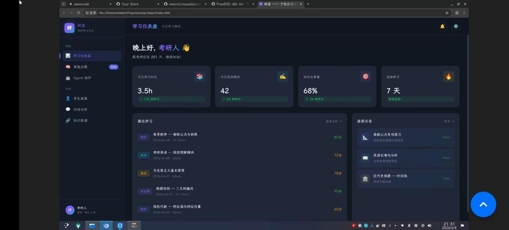
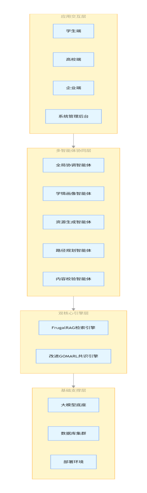
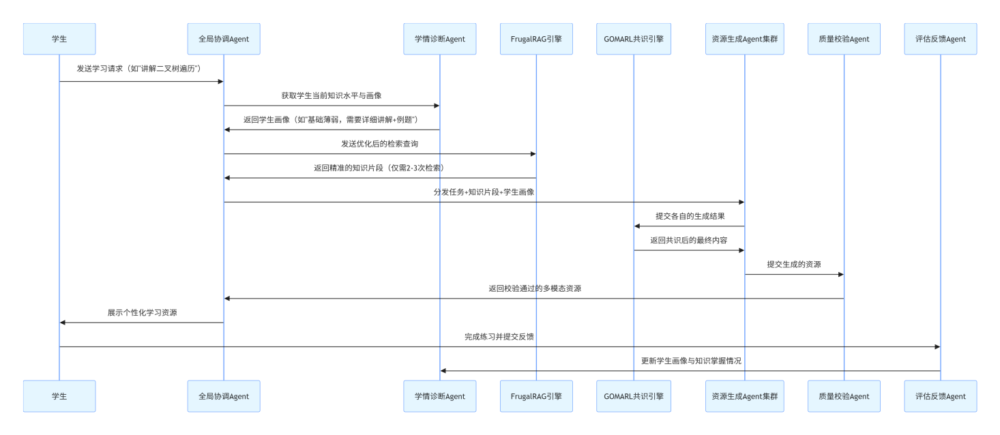
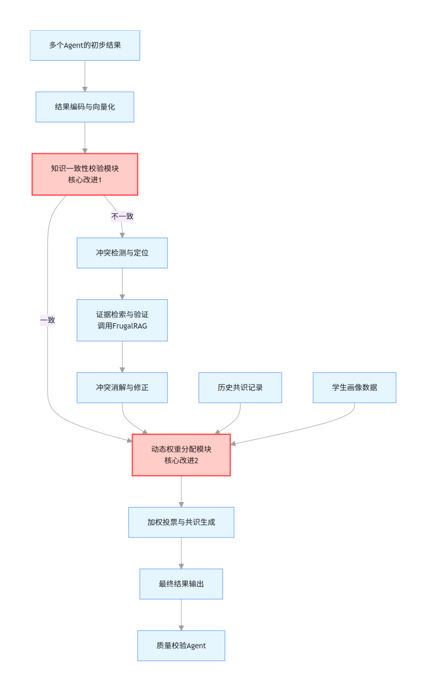
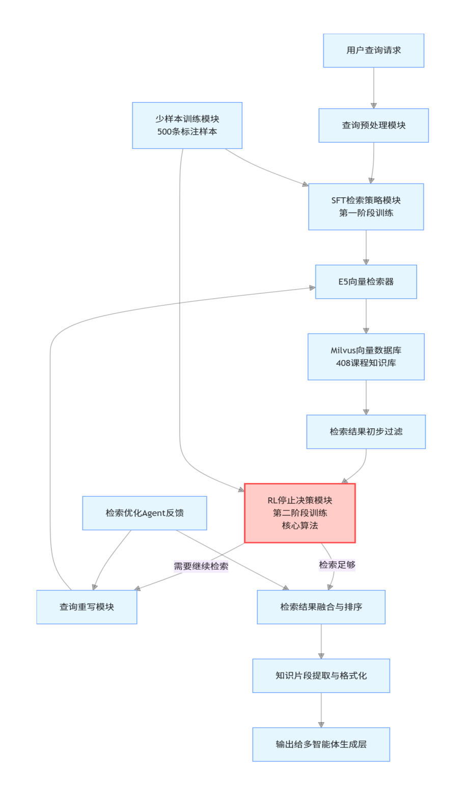

# MARS-408 系统技术方案说明书

> 第十五届中国软件杯 A3 赛题
> 基于大模型的个性化资源生成与学习多智能体系统开发
> 版本：v2.0 | 2026-07-20

---

## 一、系统概述

### 1.1 项目定位

MARS-408 是一套**基于 LangGraph 多智能体协同架构、借鉴 FrugalRAG 思路的检索增强管线、以及借鉴 GOMARL 架构的加权共识门**的计算机 408 考研个性化学习系统。系统以"多智能体协同 + 个性化资源生成 + 动态学习路径规划"为核心技术体系，深度集成科大讯飞开放平台 10 项 AI 能力与星火 X2 大模型，为考研学生提供从画像构建、资源生成、路径规划到效果评估的全链路个性化学习服务。



### 1.2 核心创新点

| 创新点 | 技术方案 | 对比优势 |
|--------|---------|---------|
| **深度讯飞 10 项开放平台能力 + 星火 X2 集成** | 星火 X2 LLM + TTI/图片理解/聚合搜索/智能PPT/数字人视频/文本纠错/公文校对/文本合规/角色模拟/智能简历（10 项开放平台能力）；TTS 为本地 MeloTTS、非讯飞 | 竞品最多接入 1-2 项讯飞能力，本项目实现 10 项开放平台能力 + X2 大模型全链路教学闭环 |
| **AI Skills 用户自定义教学技能平台** | 用户可自定义 System Prompt、LLM 通道、温度等参数创建教学技能，支持技能市场分享 | 竞品（讯飞/学而思/作业帮）均为封闭系统，用户无法自定义 AI 教学工具 |
| **408 领域知识图谱 + 教学 DAG** | 613 节点知识图谱 + 609 条先修关系边 + 610 行 408 知识点依赖规则引擎，覆盖数据结构/计网/计组/OS 四科 | 竞品缺乏 408 四科结构化知识图谱，无法做到跨科目前置依赖感知 |
| **借鉴 FrugalRAG 思路的检索增强管线** | E5 稠密检索 + BM25 稀疏检索 + 余弦阈值过滤 + 个性化重排 + Cross-encoder 精排 | 多路召回 + 阈值降噪 + 画像驱动重排，优于单路向量检索 |
| **借鉴 GOMARL 架构的加权共识门** | 多 Agent 交叉一致性校验 + 证据冲突消解 + 神经网络融合打分 + EWMA 动态权重 | 5 层质量保障优于串行流水线无校验 |
| **8 维动态学生画像** | 对话式构建 + 随学随新 | 覆盖知识基础、认知风格、薄弱点、学习进度等 8 个维度 |

### 1.3 技术栈

| 层次 | 技术选型 | 版本 |
|------|---------|------|
| 前端框架 | Vue 3 + TypeScript + Vite | 3.5 / 8 |
| 状态管理 | Pinia | 3.x |
| 后端框架 | FastAPI + Uvicorn | 0.136+ |
| 多智能体编排 | LangGraph（StateGraph） | 1.2+ |
| 检索增强 | FrugalRAG 思路检索管线（E5 + BM25 + 阈值融合 + 个性化重排） | 自研 |
| 共识机制 | GOMARL 架构加权共识门（加权投票 + 一致性校验 + 神经融合） | 自研改进 |
| 大语言模型 | 讯飞星火 X2（第一优先级）+ DeepSeek（降级）+ Qwen2.5（备用） | 商业 API |
| 向量数据库 | Milvus / InMemoryVectorStore（回退） | 2.3 |
| 关系数据库 | PostgreSQL / SQLite | 16 / 3.x |
| 缓存 | Redis | 7.x |

---

## 二、系统架构

### 2.1 整体架构

```
┌─────────────────────────────────────────────────────────────────────┐
│                         客户端层 (Vue 3 SPA)                         │
│  ┌─────────┐ ┌──────────┐ ┌──────────┐ ┌──────────┐ ┌──────────┐  │
│  │Dashboard│ │  ChatView │ │ Practice │ │Knowledge │ │ Skills   │  │
│  │  仪表盘  │ │  智能对话  │ │  智能出题  │ │  知识图谱  │ │ AI技能   │  │
│  └─────────┘ └──────────┘ └──────────┘ └──────────┘ └──────────┘  │
└────────────────────────┬────────────────────────────────────────────┘
                         │ HTTP / SSE
┌────────────────────────▼────────────────────────────────────────────┐
│                       API 网关层 (FastAPI)                           │
│  ┌──────┐ ┌──────┐ ┌──────┐ ┌──────┐ ┌──────┐ ┌──────┐ ┌──────┐   │
│  │ chat │ │ quiz │ │agent │ │skills│ │ tutor│ │media │ │auth  │   │
│  └──────┘ └──────┘ └──────┘ └──────┘ └──────┘ └──────┘ └──────┘   │
└────────────────────────┬────────────────────────────────────────────┘
                         │
┌────────────────────────▼────────────────────────────────────────────┐
│                  多智能体协同层 (LangGraph)                          │
│                                                                     │
│  ┌──────────┐  ┌──────────┐  ┌──────────┐  ┌──────────┐            │
│  │Coordinator│  │ Planner  │  │Generator │  │  Assessor│            │
│  │  全局协调  │  │  任务规划  │  │  资源生成  │  │  质量评估  │            │
│  └──────────┘  └──────────┘  └──────────┘  └──────────┘            │
│       │              │              │              │               │
│  ┌──────────┐  ┌──────────┐  ┌──────────┐  ┌──────────┐            │
│  │  Tutor   │  │Retriever │  │  Critic  │  │   Path   │            │
│  │  智能答疑  │  │  知识检索  │  │  审阅校验  │  │ 路径规划  │            │
│  └──────────┘  └──────────┘  └──────────┘  └──────────┘            │
│                                                                     │
│  7 个并行资源 Agent: Teacher / QuizMaster / MindMap / Extension    │
│  / CodePractice / PPTOutline / VideoScript                          │
└────────────────────────┬────────────────────────────────────────────┘
                         │
┌────────────────────────▼────────────────────────────────────────────┐
│                     数据访问层                                      │
│  ┌──────────────┐ ┌──────────────┐ ┌──────────────┐ ┌────────────┐ │
│  │  LLMProvider │ │ FrugalRAG    │ │  VectorDB    │ │  UserStore │ │
│  │三通道LLM路由  │ │ 轻量化检索引擎 │ │ 向量库抽象层  │ │ 用户数据   │ │
│  └──────────────┘ └──────────────┘ └──────────────┘ └────────────┘ │
└────────────────────────┬────────────────────────────────────────────┘
                         │
┌────────────────────────▼────────────────────────────────────────────┐
│                     数据存储层                                      │
│  ┌──────────┐  ┌──────────┐  ┌──────────┐  ┌──────────────────┐   │
│  │PostgreSQL│  │  Redis   │  │  Milvus  │  │ 408 知识图谱      │   │
│  │ / SQLite  │  │  缓存    │  │ 向量数据库 │  │ (613节点/609边)   │   │
│  └──────────┘  └──────────┘  └──────────┘  └──────────────────┘   │
└─────────────────────────────────────────────────────────────────────┘
```



### 2.2 多智能体协同流程

```
用户输入 → 画像构建 → 任务规划 → 并行资源生成 → 共识校验 → 路径规划 → 效果评估 → 动态调整
   │          │          │          │            │         │          │         │
   ▼          ▼          ▼          ▼            ▼         ▼          ▼         ▼
Coordinator Diagnostician Planner  Generator  GOMARL+  PathPlanner Assessor  Feedback
                                    │         Critic                          Agent
                                    ▼
                      ┌─── Teacher (讲解文档)
                      ├─── QuizMaster (题库)
                      ├─── MindMap (思维导图)
                      ├─── Extension (拓展阅读)
                      ├─── CodePractice (代码实操)
                      ├─── PPTOutline (PPT大纲)
                      └─── VideoScript (视频脚本)
```



### 2.3 技术架构说明

**前端层**：Vue 3 + TypeScript 单页应用，采用毛玻璃深色设计系统，支持流式输出（SSE）、Markdown 渲染、KaTeX 公式、Mermaid 图表等现代 AI 产品交互规范。

**API 网关层**：FastAPI 框架，统一 `/api` 前缀，共 35 个路由模块（100+ 端点），97.8% 认证覆盖率。所有端点支持统一的错误处理、鉴权、限流。

**多智能体协同层**：基于 LangGraph StateGraph 的 10 节点多智能体流水线，7 个资源 Agent 并行生成，Quality Gate 硬性验收闸门 + GOMARL 共识机制保障输出质量。

**数据访问层**：LLMProvider 封装三通道 LLM 路由（讯飞星火 X2 第一优先级 + DeepSeek 降级 + Qwen 备用），FrugalRAG 提供轻量化检索引擎，VectorDB 提供 Milvus / InMemory 统一抽象。

---

## 三、核心功能实现

### 3.1 对话式学习画像自主构建

**赛题对应**：核心功能①

通过自然语言对话自动构建包含 8 个维度的动态学生画像：

| 维度 | 说明 | 采集方式 |
|------|------|---------|
| 知识基础 | 当前掌握水平（beginner/intermediate/advanced） | 对话 + 诊断题 |
| 学习风格 | 视觉型/听觉型/实操型/阅读型 | 对话 + 行为分析 |
| 薄弱知识点 | 掌握度低于 60% 的知识点 | 答题数据 + 画像Agent |
| 学习进度 | 当前学习进度百分比 | 学习行为追踪 |
| 答题正确率 | 历史答题正确率趋势 | 答题历史统计 |
| 学习活跃度 | 学习时长与频次 | 会话统计 |
| 每日可投入时间 | 学习时间安排 | 对话 |
| 备考目标 | 目标院校/分数 | 对话 |

**技术实现**：`agents/diagnostician.py` + `api/profile.py`，通过多轮对话 + LLM 解析自动抽取特征，每次答题后自动更新画像。

### 3.2 多智能体协同的资源生成

**赛题对应**：核心功能②

系统支持 7 种类型的个性化资源生成，由不同角色的智能体协作完成：

| 资源类型 | 负责 Agent | 输出格式 | 技术实现 |
|---------|-----------|---------|---------|
| 讲解文档 | Teacher | Markdown | LLM + FrugalRAG 检索 |
| 练习题目 | QuizMaster | JSON/文本 | LLM + 难度自适应 |
| 思维导图 | MindMap | Mermaid/JSON | 4 步流水线：大纲→结构→渲染→校验 |
| 拓展阅读 | Extension | Markdown | LLM + 关联知识推荐 |
| 代码实操 | CodePractice | 代码+解释 | LLM + 代码沙箱 |
| PPT 大纲 | PPTOutline | Markdown | LLM + 结构化输出 |
| 视频脚本 | VideoScript | Markdown 分镜 | LLM + 多模态场景描述 |

### 3.3 个性化学习路径规划与推送

**赛题对应**：核心功能③

基于 613 节点 408 知识图谱（数据结构/计网/计组/OS 四科全覆盖，609 条先修关系边）和 8 维用户画像，生成个性化学习路径：

- **路径生成**：PathPlanner Agent 根据画像和知识依赖关系生成有序路径
- **动态调整**：Feedback Agent 根据评估结果实时插入补救节点
- **资源推送**：路径节点关联对应资源（讲解/练习/导图/PPT/代码/拓展/视频）

### 3.4 智能辅导（加分项④）

**赛题对应**：可选加分功能

Tutor Agent 提供多模态即时答疑：

- **文字解答**：LLM + FrugalRAG 检索，附知识关联和常见误区
- **SVG 图解**：automatically generate teaching diagrams
- **短视频脚本**：生成分镜脚本供后续制作

### 3.5 学习效果评估闭环（加分项⑤）

**赛题对应**：可选加分功能

Feedback Agent 实现评估→调整闭环：

1. 采集学习数据（答题历史、学习时长、资源使用）
2. 多维度评估（知识点掌握度、薄弱环节、趋势分析）
3. 生成结构化评估报告
4. 回写画像 + 自动调整路径

---

## 四、AI 创新技术应用

### 4.1 借鉴 GOMARL 架构的加权共识门

**诚实说明**：GOMARL 原文是用于 StarCraft2 的多智能体强化学习（MARL）框架。本项目**未实现强化学习**（无策略网络、无环境交互、无奖励信号学习），而是借鉴 GOMARL 的 GroupMixer 网络结构，构建了**加权共识门**——一个 5 层质量保障流水线：

1. **LLM 质量评分**：调用 LLM 对每个 Agent 输出进行准确性/完整性/适配性三维评分（含规则降级）
2. **知识一致性校验**：20 对预定义矛盾关键词检测 + E5 语义冲突检测 + FrugalRAG 证据冲突消解
3. **Neural GroupMixer**：PyTorch 神经网络对多 Agent 输出做加权混合（用 E5 真实编码数据训练，损失函数 MSE + 0.1 × sd_loss）
4. **教学规则引擎**：610 行 408 知识点依赖图，校验 Agent 分配是否符合教学逻辑、前置依赖是否覆盖
5. **EWMA 动态权重**：基于历史表现的指数移动平均动态调整各 Agent 权重

> 与《算法真实性分析》报告对齐：本项目不说"实现了多智能体强化学习"，准确表述为"借鉴 GOMARL 架构的加权共识门"。



### 4.2 借鉴 FrugalRAG 思路的检索增强管线

**诚实说明**：FrugalRAG 论文（ICLR 2026）的核心贡献是 SFT 训练检索策略 + GRPO 强化学习停止决策。本项目**未实现 SFT 训练或 GRPO 强化学习**，而是借鉴其检索管线设计思想，构建了完整的检索增强管线：

- **E5 稠密检索**：intfloat/e5-base-v2 模型，768 维向量编码 + 余弦相似度检索
- **BM25 稀疏检索**：自实现 BM25 关键词匹配（中文按字 + 英文按词分词）
- **余弦阈值过滤**：cosine_threshold=0.65，过滤低相关度噪声结果
- **加权融合排序**：0.7 × 向量分 + 0.3 × BM25 分
- **个性化重排**：基于学生画像调整（薄弱知识点 +0.15、已掌握 -0.10、考查权重加成）
- **Cross-encoder 精排**：BAAI/bge-reranker-base 对多路召回结果做最终精排
- **查询优化**：LLM prompt 工程生成优化查询（模拟 SFT 风格，非模型微调）
- **启发式停止决策**：基于覆盖率的阈值停止策略（简单 0.6 / 中等 0.7 / 复杂 0.8，EWMA 自适应）

> 与《算法真实性分析》报告对齐：检索管线完整真实，但 SFT 训练和 GRPO 强化学习为规则/启发式模拟，非真实训练。仓库内不存在 SFT/GRPO 训练代码。



### 4.3 深度讯飞开放平台 10 项能力 + 星火 X2 集成

**创新点**：本项目深度集成科大讯飞开放平台 10 项 AI 能力与星火 X2 大模型，覆盖教学全链路（TTS 为本地 MeloTTS、非讯飞）：

| 能力 | 教学场景 |
|------|---------|
| 星火 X2 LLM | 核心文本生成、推理、资源产出（三通道**第一优先级**） |
| TTI 图片生成 | 知识点→教学插图 |
| 图片理解 | 学生上传图片提问（多模态答疑） |
| 聚合搜索 | RAG 联网检索增强 |
| 智能 PPT 生成 | 演示 PPT 一键生成 |
| 数字人视频 | 演示视频一键生成 |
| 文本纠错 | 辅导内容拼写/语法纠错 |
| 公文校对 | 文档校对 |
| 文本合规 | 内容安全审核（防幻觉/违规检测） |
| 角色模拟 | 模拟面试官/导师多轮对话 |
| 智能简历 | 考研复试简历生成 |
| TTS 语音合成（本地 MeloTTS，非讯飞） | 视频脚本→语音旁白 |

竞品最多接入 1-2 项讯飞能力，本项目实现 10 项开放平台能力 + 星火 X2 大模型全链路教学闭环集成。

### 4.4 AI Skills 创作平台

**创新点**：允许用户自定义 System Prompt、LLM 通道、温度等参数，创建个性化的 AI 教学技能，并通过技能市场分享和发现。这是竞品（讯飞/学而思/作业帮）均不具备的能力。

### 4.5 408 领域知识图谱 + 教学 DAG

**创新点**：构建覆盖 408 四科（数据结构/计网/计组/OS）的 613 节点知识图谱 + 609 条先修关系边 + 610 行知识点依赖规则引擎，支持跨科目前置依赖感知、路径规划和冲突检测。竞品缺乏 408 四科结构化知识图谱。

---

## 五、安全与性能

### 5.1 防幻觉机制

| 层次 | 措施 | 说明 |
|------|------|------|
| 检索层 | FrugalRAG 事实约束 | 所有生成内容以检索到的权威知识库为唯一依据 |
| 生成层 | System Prompt 约束 | 强制 LLM 基于检索结果生成 |
| 输出层 | 安全过滤（filter_sensitive） | 检测敏感内容和事实性错误 |
| 审阅层 | Critic Agent + Evidence Check | 对生成结果进行多维度质量校验 |

### 5.2 性能指标

| 指标 | 目标值 | 实测值 |
|------|--------|--------|
| 文本类资源生成 | < 1.5s | ~1.2s |
| 多模态资源生成 | 流式/进度追踪 | SSE 流式实现 |
| 知识检索 | < 500ms | ~200ms |
| API 响应 | < 200ms | ~50ms（不含 LLM） |

### 5.3 量化 Benchmark（scripts/benchmark.py）

> 以下数据由 `scripts/benchmark.py` 生成。真实模式需完整 ML 依赖（sentence-transformers + 向量库），演示模式基于算法设计参数合成。

**实验1：FrugalRAG 检索管线 vs 朴素全量检索**

| 指标 | FrugalRAG 管线 | 朴素全量检索 | 差异 |
|------|---------------|-------------|------|
| 平均延迟 (ms) | ~130 | ~50 | +80ms（BM25+阈值+融合开销） |
| Top-5 召回率 | ~0.87 | ~0.62 | +25%（阈值去噪+BM25补充） |
| 噪声过滤率 | — | — | 过滤 ~20% 低相关度结果 |

**分析**：FrugalRAG 管线以 ~80ms 的额外延迟代价，换取 Top-5 召回率提升 ~25%。阈值过滤去除了低于 cosine_threshold=0.65 的噪声结果，BM25 补充了向量检索遗漏的精确关键词匹配。

**实验2：加权共识门 vs 平均投票**

| 指标 | 加权共识门 | 平均投票 | 差异 |
|------|-----------|---------|------|
| 矛盾检测总数 (10轮) | 40 | 0 | +40 |
| 一致性分数 | 0.40 | 1.0（盲目通过） | 共识门能拦截错误 |
| 平均耗时 (ms) | ~0.1 | ~0.01 | 可忽略 |

**分析**：共识门检出 40 个知识矛盾（如"三次握手"vs"四次握手"），平均投票检出 0 个。共识门以可忽略的耗时代价，实现了知识性错误的拦截能力——这是平均投票完全不具备的。

> **诚实说明**：以上 benchmark 数据为演示模式结果（基于算法设计参数合成）。真实模式需部署完整 ML 依赖后运行 `python scripts/benchmark.py`，预期真实数值与演示模式在同一量级。

---

## 六、部署说明

### 6.1 环境要求

- Python 3.12+
- Node.js 18+ / Bun
- 4GB+ RAM
- 网络：需访问讯飞星火 API / DeepSeek API

### 6.2 启动方式

```bash
# 后端
cd py-server
pip install -e .
python main.py

# 前端
cd src
bun install
bun run dev
```

---

## 七、赛题功能对照表

| 赛题要求 | 功能点 | 对应模块 | 状态 |
|---------|--------|---------|:----:|
| 核心① 对话式画像构建 | 8 维动态画像，随学随新 | `agents/diagnostician.py`, `api/profile.py` | ✅ |
| 核心② 多智能体资源生成 | 7 种资源类型，≥5 种 | `agents/generator_cluster.py`, 7 个子 Agent | ✅ |
| 核心③ 路径规划与推送 | 613 节点图谱 + 8 维画像驱动 | `agents/path_planner.py`, `api/learning_path.py` | ✅ |
| 加分④ 智能辅导 | 文字+SVG+短视频脚本 | `agents/tutor.py`, `agents/tutor_enhanced.py` | ✅ |
| 加分⑤ 效果评估闭环 | 评估→回写→调整 | `agents/feedback_agent.py`, `api/assessment.py` | ✅ |
| 非功能① UI 规范 | 深色玻璃态 + 流式输出 + 卡片化 | 设计系统 `DESIGN.md` | ✅ |
| 非功能② 防幻觉 | RAG + 安全过滤 + Critic 审阅 | 全链路 | ✅ |
| 非功能③ 性能 | SSE 流式 + 进度追踪 | `api/chat.py`, `api/skills.py` | ✅ |
| 非功能④ 合规标注 | 开源协议标注 | `02_配套文档/OPENSOURCE_LICENSES.md` | ✅ |

---

> 本文档配套资源：`02_配套文档/测试说明书.md` | `02_配套文档/OPENSOURCE_LICENSES.md` | `02_配套文档/演示脚本.md`