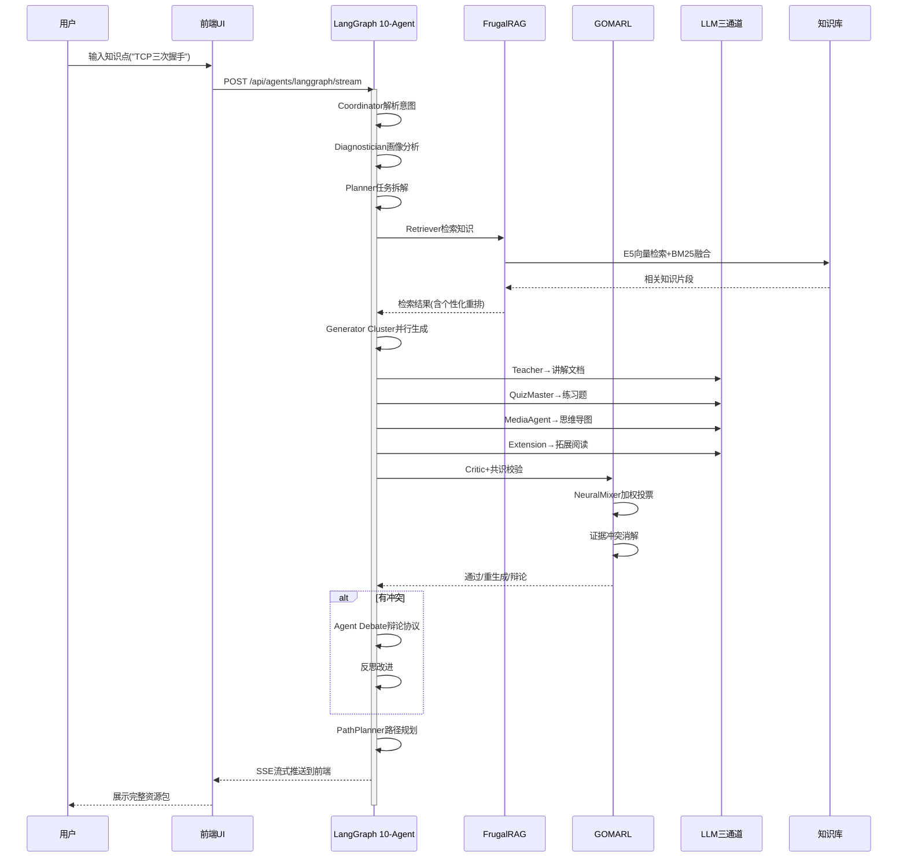

# MARS-408 系统架构设计文档

> 版本: 2.0 | 日期: 2026-07-20 | 架构师: Software Architect Agent
>
> 包含: 系统架构图(Mermaid) + 6有界上下文 + 技术栈全景 + 双线演进路线
> 
> **注意**: 本文档描述的是 2026-07-04 时的架构快照。当前系统已升级至 10 节点 StateGraph（新增 Evidence Check + Quality Gate），35 路由模块，500+ 测试全绿。架构设计原则和 ADR 决策仍然有效。

## 目录

1. [系统架构总览图 (Mermaid)](#0-系统架构总览图)
2. [执行摘要](#1-执行摘要)
3. [现状分析与架构债务](#2-现状分析与架构债务)
4. [有界上下文划分](#3-有界上下文划分)
5. [目标架构设计](#4-目标架构设计)
6. [架构决策记录 (ADR)](#5-架构决策记录-adr)
7. [演进路线图](#6-演进路线图)
8. [质量属性分析](#7-质量属性分析)
9. [风险矩阵](#8-风险矩阵)

---

## 0. 系统架构总览图

```mermaid
graph TB
    subgraph 前端层["🎨 前端层 (Vue 3 + TypeScript + Vite 8)"]
        UI[Dashboard / Chat / Practice<br/>Assessment / Knowledge / Profile]
        SSE[SSE 流式消费 · Agent进度可视化]
        Components[12视图 + 8组件<br/>雷达图/热力图/思维导图/TCP动画]
    end

    subgraph 路由层["🔌 API 路由层 (FastAPI 35 路由模块)"]
        ChatAPI[/api/chat]
        ProfileAPI[/api/profile]
        QuizAPI[/api/quiz]
        AgentAPI[/api/agents]
        RAGAPI[/api/rag]
        EngineAPI[/api/engine]
        SideAPI[/api/learning-path, /api/assessment...]
    end

    subgraph Agent层["🤖 多智能体编排层 (LangGraph 10-Node StateGraph)"]
        C[Coordinator<br/>全局协调] --> D[Diagnostician<br/>学情诊断]
        D --> P[Planner<br/>任务规划]
        P --> R[Retriever<br/>FrugalRAG检索]
        R -->|有结果| GC[Generator Cluster]
        R -->|无结果| P
        GC --> A[Assessor<br/>评估反馈]
        A --> CR[Critic<br/>质量审阅]
        CR -->|通过| EC[EvidenceCheck<br/>证据检测]
        EC --> QG[QualityGate<br/>质量闸门]
        QG -->|PASS| PP[PathPlanner<br/>路径规划]
        QG -->|FIX| R
        QG -->|REJECT| END
        CR -->|辩论| DEBATE[Agent Debate<br/>辩论+反思]
        DEBATE --> PP
        PP --> END
    end

    subgraph 引擎层["⚙️ 双引擎核心"]
        FR[FrugalRAG<br/>节俭检索引擎]
        GO[GOMARL<br/>共识投票引擎]
        TR[TeachingRules<br/>教学规则引擎]
        NM[NeuralMixer<br/>神经网络混合器]
        EC[EvidenceConflict<br/>证据冲突消解]
    end

    subgraph 数据层["🗄️ 数据层"]
        VB[(Vector DB<br/>Milvus / InMemory)]
        PG[(PostgreSQL<br/>画像/答题记录)]
        RD[(Redis<br/>缓存/Agent权重)]
        E5[E5-base-v2<br/>768维嵌入]
    end

    subgraph LLM层["🧠 三通道 LLM 容灾"]
        XF[🔥 讯飞星火 X2<br/>第一优先级·赛题合规]
        DS[DeepSeek<br/>第二优先级]
        QW[Qwen2.5<br/>第三优先级]
    end

    前端层 --> 路由层
    路由层 --> Agent层
    Agent层 --> 引擎层
    引擎层 --> 数据层
    Agent层 --> LLM层
    引擎层 --> LLM层

```


### 架构分层说明

| 层 | 技术栈 | 职责 |
|---|--------|------|
| 前端层 | Vue 3 + TypeScript + Vite + Pinia | 12视图(画像/聊天/资源/路径/练习/评估/引擎/沙箱等) + SSE流式消费 |
| API路由层 | FastAPI 35 路由模块 | REST + SSE 双协议，双挂载(/api/v1 + /api) |
| Agent编排层 | LangGraph 10节点StateGraph | 协调→诊断→规划→检索→生成→评估→审阅→证据检测→质量闸门→路径规划，含 Quality Gate 三向路由(PASS/FIX/REJECT) |
| 双引擎核心 | FrugalRAG + GOMARL (自研) | 节俭检索 + 共识投票 + 证据冲突消解 + 教学规则约束 |
| 数据层 | Milvus / PG / Redis / E5 | 向量存储 + 持久化 + 缓存 + 嵌入 |
| LLM层 | 讯飞星火X2 / DeepSeek / Qwen2.5 | 三通道自动容灾路由 |

### 核心数据流




---

## 1. 执行摘要

### 1.1 问题陈述

MARS-408 是一个面向计算机 408 考研的个性化学习多智能体系统，当前处于"软件杯 Lite 版 → 大创真版"的双线演进阶段。系统已具备完整的 10-Agent LangGraph 流水线、FrugalRAG 检索增强、GoMARL 多智能体共识三大核心能力，但在架构层面存在循环依赖、全局单例、安全沙箱不足等技术债务，制约了从原型到生产系统的演进。

### 1.2 核心决策

| 决策 | 选择 | 理由 |
|------|------|------|
| 架构风格 | 模块化单体 (Modular Monolith) | 团队规模(1人开发) + 单体部署简单 + 模块边界为未来拆分留接缝 |
| 上下文边界 | 6 个有界上下文 | 按业务领域而非技术层切分 |
| 数据一致性 | 最终一致性 + Saga 模式 | 教育场景容忍短暂不一致，换取可用性 |
| 通信模式 | 进程内调用 + 未来事件总线 | Phase 1 同步，Phase 2 引入异步 |
| 部署策略 | 单进程 ASGI + 未来容器化 | 渐进式容器化，不过早引入 K8s |

### 1.3 不做什么 (Anti-Goals)

- **不做微服务拆分**（当前阶段）：1 人团队无法承担分布式系统的运维成本
- **不做 CQRS**：当前读写比例不需要读写分离
- **不做事件溯源**：教育场景不需要完整审计日志，PG 的 append-only 足够
- **不引入消息队列**（Phase 1）：Redis Stream 足以覆盖异步需求
- **不做自定义 ORM**：SQLAlchemy 已经够好

---

## 2. 现状分析与架构债务

### 2.1 当前架构快照

```
Vue 3 SPA → FastAPI (35 routes) → LangGraph 10-Agent → Engines (FrugalRAG + GoMARL) → DB (Milvus/PG/Redis)
```

**已验证的能力：**
- 10-Agent StateGraph 条件路由 + 重试循环（coordinator → diagnostician → planner → retriever → generator_cluster → assessor → critic → evidence_check → quality_gate → path_planner）
- FrugalRAG 三层检索（Lite: E5+BM25 融合 / SFT风格: LLM查询优化+ReAct 多轮 / Stop: 启发式覆盖率阈值停止,GRPO思路非RL）
- GoMARL 共识（NeuralMixer + 证据冲突消解 + 教学规则约束）
- LLM 三通道路由（讯飞星火 X2 → DeepSeek → Qwen 自动降级）
- InMemoryVectorStore → Milvus 优雅降级
- 500+ 测试全绿

### 2.2 架构债务清单（按严重度排序）

| ID | 债务 | 严重度 | 影响 | 修复阶段 |
|----|------|--------|------|----------|
| D-01 | **循环依赖**: `db/milvus_client.py` → `engines/frugal_rag.py` → `db/milvus_client.py` | P0 | 违反分层架构原则，阻碍测试隔离 | Phase 1 |
| D-02 | **明文密钥**: `config.json` 存储 API Key | P0 | 安全风险，代码泄露即密钥泄露 | Phase 1 |
| D-03 | **沙箱不安全**: `subprocess.run(["python", tmpfile])` 在主进程执行用户代码 | P0 | 可通过 `__import__` 绕过模块拦截 | Phase 2 |
| D-04 | **全局单例**: 所有 DB 客户端模块级实例化，无依赖注入 | P1 | 无法 mock 替换，测试困难 | Phase 1 |
| D-05 | **上帝文件**: `learning.py` 混合 5 个无关路由（路径/沙箱/配置/科目/评估） | P1 | 违反单一职责，修改风险扩散 | Phase 1 |
| D-06 | **InMemoryVectorStore 性能**: JSON 全量序列化 768 维向量 | P1 | 数据量 >1000 条时序列化耗时 >5s | Phase 2 |
| D-07 | **API 无版本控制**: 所有路由无 `/v1` 前缀 | P2 | 破坏性变更无法兼容旧客户端 | Phase 1 |
| D-08 | **错误处理不一致**: HTTPException / JSON error / SSE error 三种模式混用 | P2 | 前端需要针对每种模式写不同处理 | Phase 1 |
| D-09 | **CORS 全开放**: `allow_origins=["*"]` | P2 | 生产环境安全风险 | Phase 2 |
| D-10 | **LLMProvider 私有方法暴露**: `api/chat.py` 直接调用 `llm._resolve()` | P2 | 封装不足，内部实现耦合 | Phase 1 |

---

## 3. 有界上下文划分

### 3.1 上下文地图

基于领域驱动设计（DDD），将系统划分为 6 个有界上下文：

```
┌─────────────────────────────────────────────────────────────┐
│                    Domain Layer                             │
│                                                             │
│  ┌──────────┐  ┌──────────┐  ┌──────────┐  ┌──────────┐   │
│  │ Learning │  │ Knowledge│  │ Student  │  │ Content  │   │
│  │          │  │          │  │          │  │          │   │
│  │ Agent    │  │ RAG      │  │ Profile  │  │ Resource │   │
│  │ pipeline │  │ Vector   │  │ Progress │  │ Gen      │   │
│  │ Path     │  │ Ingest   │  │ Quiz     │  │ PPT/Code │   │
│  └────┬─────┘  └────┬─────┘  └────┬─────┘  └────┬─────┘   │
│       │             │             │             │          │
│  ┌────┴─────────────┴─────────────┴─────────────┴────┐    │
│  │              Shared Kernel                         │    │
│  │  Config · Models · Utils · Event Bus · Telemetry  │    │
│  └───────────────────────────────────────────────────┘    │
│                                                             │
│  ┌──────────┐  ┌──────────┐  ┌──────────┐                │
│  │   AI     │  │ Algorithm│  │ Teaching │                │
│  │ Infra    │  │          │  │ Rules    │                │
│  │          │  │ GoMARL   │  │          │                │
│  │ LLM      │  │ FrugalRAG│  │ 408 dep  │                │
│  │ Embed    │  │ Mixer    │  │ weights  │                │
│  └──────────┘  └──────────┘  └──────────┘                │
└─────────────────────────────────────────────────────────────┘
```

### 3.2 上下文职责定义

#### 3.2.1 Learning Context (核心域)

**职责**: 多智能体编排、学习路径规划、学情诊断

**聚合根**: `LearningSession`

**领域事件**:
- `LearningSessionStarted` — 学生发起学习请求
- `DiagnosisCompleted` — 诊断 Agent 输出薄弱点
- `ResourceGenerated` — 生成集群产出教学资源
- `LearningPathPlanned` — 路径规划完成
- `ConsensusReached` — GoMARL 共识达成

**命令**:
- `StartLearningSession` — 启动学习会话
- `RequestDiagnosis` — 请求学情诊断
- `GenerateResources` — 生成教学资源
- `PlanLearningPath` — 规划学习路径

**不变量**:
- 一个 LearningSession 同一时刻只能有一个活跃的 Agent 流水线
- Generator Cluster 的 4 个子 Agent 必须全部完成才能进入 Assessor
- Critic 标记 flagged 时必须回到 Retriever 重试，最多 3 轮

**当前代码映射**: `agents/` 目录全部 + `api/agents.py` + `api/langgraph.py`

#### 3.2.2 Knowledge Context (支撑域)

**职责**: 知识库管理、RAG 检索、文档摄入、向量存储

**聚合根**: `KnowledgeChunk`

**领域事件**:
- `DocumentUploaded` — 文档上传完成
- `ChunksEmbedded` — 语义分块 + 嵌入完成
- `RetrievalCompleted` — RAG 检索返回结果
- `KnowledgeReindexed` — 知识库重建索引

**命令**:
- `UploadDocument` — 上传文档
- `SemanticChunk` — 语义分块
- `SearchKnowledge` — 检索知识
- `ReindexKnowledge` — 重建索引

**不变量**:
- 每个 KnowledgeChunk 必须有 embedding（非零向量或 fallback_zero 标记）
- 向量维度固定 768（E5-base-v2）
- 检索结果必须标注来源科目和置信度

**当前代码映射**: `api/rag.py` + `api/knowledge.py` + `engines/frugal_rag*.py` + `db/milvus_client.py`

#### 3.2.3 Student Context (支撑域)

**职责**: 学生画像、答题记录、学习进度跟踪

**聚合根**: `StudentProfile`

**领域事件**:
- `ProfileUpdated` — 画像维度更新
- `QuizSubmitted` — 答题提交
- `WeaknessIdentified` — 薄弱知识点识别
- `ProgressUpdated` — 学习进度更新

**不变量**:
- 画像必须包含 8 个维度（知识掌握/学习风格/认知水平/时间偏好/难度偏好/科目权重/薄弱领域/学习目标）
- 答题正确率按 (科目, 知识点) 二维聚合
- 画像更新需追溯来源（对话推断 / 答题统计 / 教师标注）

**当前代码映射**: `api/profile.py` + `api/quiz.py`

#### 3.2.4 Content Context (支撑域)

**职责**: 教学资源生成（讲解文档/练习题/思维导图/拓展阅读/PPT大纲/代码案例/审核报告）

**聚合根**: `GeneratedResource`

**领域事件**:
- `ResourceGenerationRequested` — 请求资源生成
- `ResourceGenerated` — 资源生成完成
- `ResourceReviewed` — Critic 审阅完成
- `ResourcePublished` — 资源发布

**不变量**:
- 资源类型必须属于 7 种已定义类型之一
- 每个资源必须关联至少一个知识点
- 资源生成必须经过 GoMARL 共识 + Critic 审阅

**当前代码映射**: `agents/generator_cluster.py` + `api/agents.py` 中的资源生成部分

#### 3.2.5 AI Infrastructure Context (通用域)

**职责**: LLM 路由、嵌入服务、模型管理

**聚合根**: `LLMChannel`

**不变量**:
- 三通道自动降级（讯飞星火 X2 → DeepSeek → Qwen）
- 嵌入模型固定 E5-base-v2（768 维）
- LLM 调用必须记录 token 消耗和延迟

**当前代码映射**: `db/llm_provider.py` + `engines/frugal_rag.py` 的嵌入部分

#### 3.2.6 Teaching Rules Context (通用域)

**职责**: 408 教学业务规则（知识点前置依赖、考查权重、Agent 调度适配）

**聚合根**: `KnowledgeGraph`

**不变量**:
- 知识图谱 group 编号按科目偏移（计网 1-7 / DS 8-14 / 计组 15-21 / OS 22-26）
- 前置依赖必须无环（DAG）
- 考查权重之和 = 1.0（每科目内）

**当前代码映射**: `engines/teaching_rules.py` + `seed_data.py` 知识图谱部分

### 3.3 上下文映射 (Context Map)

```
Learning ──[Customer/Supplier]──> Knowledge
    │                                  │
    │ [Customer/Supplier]               │ [Shared Resource]
    │                                  │
    ▼                                  ▼
Student ←──[Conformist]────── AI Infrastructure
    │                                  │
    │ [Customer/Supplier]               │ [Customer/Supplier]
    │                                  │
    ▼                                  ▼
Content ──[Customer/Supplier]──> Teaching Rules
```

**关系说明**:
- **Customer/Supplier**: Learning 是 Knowledge 的客户，Knowledge 提供检索能力
- **Conformist**: Student 遵循 AI Infrastructure 的接口约定
- **Shared Resource**: Knowledge 和 AI Infrastructure 共享嵌入服务
- **Anti-Corruption Layer**: 所有上下文通过 Shared Kernel 通信，不直接引用对方内部实现

---

## 4. 目标架构设计

### 4.1 分层架构

```
┌─────────────────────────────────────────────────┐
│  Presentation Layer                              │
│  Vue 3 SPA · TypeScript · Vite                   │
│  ─────────────────────────────────────────────   │
│  DashboardView · EngineView · ChatView           │
│  ProfileView · KnowledgeView · QuizView          │
├─────────────────────────────────────────────────┤
│  API Layer (FastAPI)                             │
│  ─────────────────────────────────────────────   │
│  Router (v1) · Middleware · SSE · Validation     │
│  ┌─────────┐ ┌─────────┐ ┌─────────┐           │
│  │Learning │ │Knowledge│ │ Student │  ...       │
│  │ Router  │ │ Router  │ │ Router  │            │
│  └────┬────┘ └────┬────┘ └────┬────┘            │
├───────┼───────────┼───────────┼─────────────────┤
│  Domain Layer                                    │
│  ─────────────────────────────────────────────   │
│  ┌─────▼────┐ ┌────▼─────┐ ┌────▼────┐          │
│  │ Learning │ │Knowledge │ │ Student │  ...      │
│  │ Service  │ │ Service  │ │ Service │           │
│  │          │ │          │ │         │           │
│  │ Agent    │ │ RAG      │ │ Profile │           │
│  │ Graph    │ │ Engine   │ │ Builder │           │
│  └────┬─────┘ └────┬─────┘ └────┬────┘           │
│       │            │            │                 │
│  ┌────┴────────────┴────────────┴────┐           │
│  │         Shared Kernel              │           │
│  │  Events · Models · Config · Utils  │           │
│  └───────────────────────────────────┘           │
├─────────────────────────────────────────────────┤
│  Infrastructure Layer                            │
│  ─────────────────────────────────────────────   │
│  ┌────────┐ ┌────────┐ ┌────────┐ ┌────────┐   │
│  │ Milvus │ │  PG    │ │ Redis  │ │ File   │   │
│  │ Vector │ │ Relat. │ │ Cache  │ │ Store  │   │
│  └────────┘ └────────┘ └────────┘ └────────┘   │
│  ┌────────┐ ┌────────┐                          │
│  │  E5    │ │ LLM    │                          │
│  │ Embed  │ │ Router │                          │
│  └────────┘ └────────┘                          │
└─────────────────────────────────────────────────┘
```

### 4.2 关键架构原则

#### 原则 1: 依赖方向单向向下

```
Presentation → API → Domain → Infrastructure
                                  ↑
                          (接口反转, DI 注入)
```

**实施**: Domain 层定义 Repository 接口（Protocol/ABC），Infrastructure 层实现。API 层通过 DI 容器注入实现。

```python
# domain/interfaces.py — Domain 层定义接口
from typing import Protocol

class IVectorStore(Protocol):
    async def search(self, query_vector: list[float], top_k: int) -> list[SearchResult]: ...
    async def insert(self, chunks: list[KnowledgeChunk]) -> int: ...

class ILLMRouter(Protocol):
    async def chat(self, messages: list[dict], **kwargs) -> LLMResponse: ...
    async def embed(self, texts: list[str]) -> list[list[float]]: ...

# infrastructure/milvus_store.py — Infrastructure 层实现
class MilvusVectorStore(IVectorStore):
    async def search(self, query_vector, top_k): ...

# infrastructure/llm_provider.py — Infrastructure 层实现
class LLMRouter(ILLMRouter):
    async def chat(self, messages, **kwargs): ...
```

#### 原则 2: 上下文间通过领域事件通信

Phase 1 使用进程内事件总线（简单的 pub/sub），Phase 2 升级为 Redis Stream。

```python
# shared/events.py
from collections import defaultdict
from typing import Callable, Any

class EventBus:
    def __init__(self):
        self._handlers: dict[str, list[Callable]] = defaultdict(list)

    def subscribe(self, event_type: str, handler: Callable):
        self._handlers[event_type].append(handler)

    async def publish(self, event_type: str, payload: Any):
        for handler in self._handlers[event_type]:
            await handler(payload)

# 使用示例
event_bus = EventBus()

event_bus.subscribe("QuizSubmitted", profile_service.update_weakness)
event_bus.subscribe("ResourceGenerated", content_service.notify_critic)
event_bus.subscribe("DiagnosisCompleted", planner_service.adjust_plan)
```

#### 原则 3: 配置与密钥分离

```python
# config.py — 统一配置入口
from pydantic_settings import BaseSettings

class Settings(BaseSettings):
    # 从环境变量读取，config.json 仅存非敏感配置
    deepseek_api_key: str = ""
    xfyun_api_password: str = ""
    qwen_api_key: str = ""

    # 非敏感配置可从 JSON 读取
    milvus_host: str = "localhost"
    milvus_port: int = 19530
    pg_dsn: str = ""
    redis_url: str = ""

    model_config = {"env_file": ".env", "env_file_encoding": "utf-8"}
```

### 4.3 依赖注入容器

替代当前的全局单例模式：

```python
# shared/container.py
from functools import lru_cache

class Container:
    def __init__(self, settings: Settings):
        self._settings = settings
        self._vector_store: IVectorStore | None = None
        self._llm_router: ILLMRouter | None = None
        self._event_bus: EventBus | None = None

    @property
    def vector_store(self) -> IVectorStore:
        if self._vector_store is None:
            if self._settings.milvus_host:
                self._vector_store = MilvusVectorStore(self._settings)
            else:
                self._vector_store = InMemoryVectorStore(self._settings)
        return self._vector_store

    @property
    def llm_router(self) -> ILLMRouter:
        if self._llm_router is None:
            self._llm_router = LLMRouter(self._settings)
        return self._llm_router

    @property
    def event_bus(self) -> EventBus:
        if self._event_bus is None:
            self._event_bus = EventBus()
        return self._event_bus

@lru_cache
def get_container() -> Container:
    return Container(Settings())
```

### 4.4 解决循环依赖

**当前问题**: `db/milvus_client.py` 的 `_mem_insert()` 调用 `engines/frugal_rag.embed_documents()` 来计算嵌入，形成 db → engines → db 循环。

**解决方案**: 将嵌入计算职责上移到 Service 层（Domain Layer），DB 层只负责存储。

```
Before: API → DB.insert() → Engine.embed() → DB.search()
After:  API → Service.upload() → Engine.embed() → DB.insert(precomputed_vectors)
```

```python
# domain/knowledge_service.py
class KnowledgeService:
    def __init__(self, vector_store: IVectorStore, embedder: IEmbedder):
        self._vector_store = vector_store
        self._embedder = embedder

    async def upload_document(self, file: UploadFile) -> UploadResult:
        text = await parse_file(file)
        chunks = semantic_chunk(text)
        embeddings = await self._embedder.embed([c.text for c in chunks])
        # DB 层只接收预计算好的向量，不再调用引擎层
        self._vector_store.insert(chunks, embeddings)
        return UploadResult(chunks=len(chunks))
```

### 4.5 API 版本化

```python
# main.py
from fastapi import FastAPI

app = FastAPI(title="MARS-408 API", version="1.0")

# 所有路由挂载在 /api/v1 下
from api.v1.learning import router as learning_router
from api.v1.knowledge import router as knowledge_router
# ...

api_v1 = FastAPI()
api_v1.include_router(learning_router, prefix="/learning", tags=["learning"])
api_v1.include_router(knowledge_router, prefix="/knowledge", tags=["knowledge"])
# ...

app.mount("/api/v1", api_v1)

# Phase 2: 引入 /api/v2 时，v1 和 v2 可以共存
```

### 4.6 统一错误处理

```python
# shared/errors.py
from fastapi import Request
from fastapi.responses import JSONResponse

class DomainError(Exception):
    def __init__(self, code: str, message: str, status: int = 400):
        self.code = code
        self.message = message
        self.status = status

class KnowledgeNotFoundError(DomainError):
    def __init__(self, query: str):
        super().__init__("KNOWLEDGE_NOT_FOUND", f"No results for: {query}", 404)

class LLMUnavailableError(DomainError):
    def __init__(self):
        super().__init__("LLM_UNAVAILABLE", "All LLM channels exhausted", 503)

# main.py — 全局异常处理器
@app.exception_handler(DomainError)
async def domain_error_handler(request: Request, exc: DomainError):
    return JSONResponse(
        status_code=exc.status,
        content={"error": {"code": exc.code, "message": exc.message}},
    )
```

### 4.7 拆分 learning.py

```python
# 当前: api/learning.py (366行, 5个不相关路由)

# 目标: 拆分为 4 个独立路由文件
# api/v1/learning/path.py      — 学习路径 DAG
# api/v1/learning/sandbox.py   — 代码沙箱
# api/v1/learning/config.py    — 学习配置读写
# api/v1/learning/subjects.py  — 科目 + 知识图谱
# api/v1/learning/assess.py    — 学习评估
# api/v1/learning/__init__.py  — 路由汇总
```

---

## 5. 架构决策记录 (ADR)

### ADR-001: 选择模块化单体而非微服务

**Status**: Accepted

**Context**:
MARS-408 当前由 1 人开发（学生），同时应对软件杯和大创两个竞赛节点。系统已具备 10-Agent 流水线、FrugalRAG 检索、GoMARL 共识三大核心能力，代码量约 52 个 .py 文件。需要决定整体架构风格。

**Decision**: 采用模块化单体（Modular Monolith）架构。

**Options Considered**:

| 选项 | 优点 | 缺点 | 适用场景 |
|------|------|------|----------|
| 模块化单体 | 部署简单、调试容易、无网络开销、重构成本低 | 无法独立扩展单个模块 | 小团队、边界尚在演化 |
| 微服务 | 独立扩展、技术异构、故障隔离 | 分布式复杂度、运维成本高、网络延迟 | 大团队、清晰边界、独立扩展需求 |
| 事件驱动 | 松耦合、异步处理、可扩展 | 最终一致性、调试困难、事件演化难 | 异步工作流、系统间集成 |

**Rationale**: 
- 团队规模（1 人）无法承担微服务的运维成本（服务发现、配置中心、分布式追踪、日志聚合）
- 当前模块边界尚在演化中，微服务的边界可能选错
- 模块化单体保留了未来拆分的可能性：只要模块间通过接口通信，拆分为微服务只需将进程内调用改为 HTTP/gRPC
- 软件杯 deadline（20 天）要求快速迭代，单体部署最简单

**Consequences**:
- **变容易的**: 部署、本地调试、跨模块重构、事务一致性
- **变困难的**: 独立扩展（如只扩展 RAG 检索能力）、技术异构（如 Python+Go 混合）、故障隔离（一个模块 crash 影响全部）
- **风险**: 如果模块边界不清晰，会退化为大泥球（Big Ball of Mud）。需要严格执行上下文边界规则

---

### ADR-002: 嵌入计算职责从 DB 层上移到 Service 层

**Status**: Accepted

**Context**:
当前 `db/milvus_client.py` 的 InMemory 回退模式在插入文档时调用 `engines/frugal_rag.embed_documents()` 计算嵌入向量，形成 db → engines → db 的循环依赖。这违反了分层架构原则（数据层不应依赖业务层），阻碍了测试隔离和未来替换嵌入模型。

**Decision**: 将嵌入计算职责从 DB 层上移到 Domain Service 层。DB 层只接收预计算好的向量。

**Before**:
```
API → DB.insert(text) → Engine.embed(text) → DB._store(vector)
```

**After**:
```
API → Service.upload(text) → Engine.embed(text) → DB.insert(vector)
```

**Options Considered**:

| 选项 | 描述 | 优点 | 缺点 |
|------|------|------|------|
| A. Service 层嵌入（选择） | API → Service → Engine.embed → DB.insert | 依赖方向正确、可测试 | API 层多一步调用 |
| B. DB 层接收回调 | DB.insert(text, embed_fn=engine.embed) | 改动最小 | DB 层仍然知道嵌入逻辑 |
| C. DB 层内置嵌入 | DB 内部调用嵌入服务 | 调用方最简单 | 循环依赖不解决 |

**Rationale**:
- 选项 A 是唯一彻底解决循环依赖的方案
- 选项 B 只是用回调掩盖了依赖方向问题
- 选项 C 维持现状，不可接受

**Consequences**:
- **变容易的**: 测试隔离（DB 层可 mock）、替换嵌入模型（只需改 Service 层）、理解数据流（单向）
- **变困难的**: 调用方需要显式调用嵌入服务（多一行代码）
- **迁移成本**: 需要修改 `milvus_client.py` 的 insert 接口 + 所有调用方（`api/knowledge.py`、`main.py` 的 seed 函数）

---

### ADR-003: 依赖注入容器替代全局单例

**Status**: Accepted

**Context**:
当前所有 DB 客户端（VectorDB、PgClient、RedisClient）使用模块级全局单例，LLMProvider 在每个请求中 new 一个实例但读取全局配置缓存。这导致：无法在测试中 mock 替换、所有路由共享连接状态、配置变更需要重启服务。

**Decision**: 引入轻量级 DI 容器，通过 FastAPI 的 Depends 机制注入。

**Implementation**:
```python
# FastAPI 依赖注入
from fastapi import Depends

@router.get("/search")
async def search(
    query: str,
    knowledge_service: KnowledgeService = Depends(get_knowledge_service),
):
    return await knowledge_service.search(query)
```

**Options Considered**:

| 选项 | 描述 | 优点 | 缺点 |
|------|------|------|------|
| A. FastAPI Depends（选择） | 利用 FastAPI 原生 DI | 零依赖、文档自动生成 | 仅限于请求作用域 |
| B. 第三方 DI 框架 (dependency-injector) | 完整 IoC 容器 | 生命周期管理完善 | 额外依赖、学习成本 |
| C. 保持全局单例 | 不改 | 零改动 | 不可测试、不可替换 |

**Rationale**:
- FastAPI 的 Depends 已经足够覆盖 90% 场景，不需要引入第三方框架
- 全局单例的最大问题是不可测试——这在 127 个测试中已经暴露

**Consequences**:
- **变容易的**: 测试中替换 mock 实现、请求级别的依赖覆盖、配置热更新
- **变困难的**: 每个路由函数多一个参数（但 FastAPI 自动处理）
- **迁移成本**: 需要重构所有路由函数签名 + 创建 Container 类

---

### ADR-004: API 版本化策略

**Status**: Accepted

**Context**:
当前所有 API 路由无版本前缀（`/api/chat`、`/api/rag/search`）。软件杯演示后如果需要修改 API 行为，无法保持向后兼容。

**Decision**: 采用 URL 路径版本化（`/api/v1/...`），通过 FastAPI 的 `include_router` + `mount` 实现。

**Options Considered**:

| 选项 | 描述 | 优点 | 缺点 |
|------|------|------|------|
| A. URL 路径版本化（选择） | `/api/v1/...` | 直观、缓存友好、网关易路由 | URL 变长 |
| B. Header 版本化 | `Accept-Version: v1` | URL 干净 | 不直观、缓存不友好 |
| C. Query 参数版本化 | `?version=1` | 简单 | 不 RESTful、易遗漏 |

**Rationale**: URL 路径版本化是最简单、最不容易出错的方案，且 Nginx/网关层路由最方便。

**Consequences**:
- **变容易的**: 破坏性变更可发布 v2 而 v1 继续运行、前端可渐进迁移
- **变困难的**: 需要维护多版本路由代码（但 Phase 1 只有 v1，无额外成本）
- **迁移成本**: 所有前端 API 调用路径需要加 `/v1` 前缀

---

### ADR-005: 代码沙箱安全策略

**Status**: Proposed (Phase 2 实施)

**Context**:
当前代码沙箱使用 `subprocess.run(["python", tmpfile])` 在主进程中执行用户提交的 Python 代码，仅通过 `sys.modules` 替换拦截危险模块。这可以通过 `__import__("os")` 或 `exec()` 绕过。

**Decision**: Phase 2 使用 Docker 容器隔离用户代码执行。

**Options Considered**:

| 选项 | 描述 | 安全性 | 复杂度 | 延迟 |
|------|------|--------|--------|------|
| A. Docker 容器（选择） | 每次执行启动轻量容器 | 高 | 中 | ~2s 容器启动 |
| B. nsjail / firejail | Linux 命名空间隔离 | 高 | 低 | <0.5s |
| C. WASM 沙箱 (pyodide) | 浏览器级隔离 | 高 | 高 | ~5s 冷启动 |
| D. 保持 subprocess（当前） | sys.modules 拦截 | 低 | 最低 | <0.1s |

**Rationale**:
- 选项 A 最成熟、文档最全、且 Docker 在教育场景可接受 2s 延迟
- 选项 B 仅限 Linux，Windows 不支持
- 选项 C 过于前沿，pyodide 不支持全部 Python 库

**Consequences**:
- **变容易的**: 安全隔离（用户代码无法访问宿主文件系统/网络）
- **变困难的**: 部署需要 Docker、冷启动延迟
- **Phase 1 过渡方案**: 保持 subprocess 但增加 AST 静态分析，拦截 `__import__`/`exec`/`eval`/`open` 等危险调用

---

### ADR-006: 事件总线策略

**Status**: Proposed (Phase 2 实施)

**Context**:
当前上下文间通信通过直接函数调用（如答题完成后直接调用 `profile_service.update()`）。这在 Phase 1 足够，但 Phase 2 需要异步处理（如知识库导入完成后触发索引重建、资源生成完成后通知 Critic）。

**Decision**: Phase 1 使用进程内同步事件总线；Phase 2 升级为 Redis Stream。

**Phase 1 实现方案**:
```python
class EventBus:
    """进程内同步事件总线"""
    async def publish(self, event: DomainEvent): ...
    def subscribe(self, event_type: str, handler): ...
```

**Phase 2 升级路径**:
```python
class RedisEventBus:
    """Redis Stream 异步事件总线"""
    async def publish(self, event: DomainEvent):
        await self._redis.xadd(event.event_type, event.dict())
    async def consume(self, event_type: str, handler):
        # Consumer group 模式
        ...
```

**Consequences**:
- **变容易的**: 上下文解耦、异步任务处理、未来可拆分为消息队列
- **变困难的**: 调试复杂度增加（事件追踪）、最终一致性问题
- **关键约束**: 事件 schema 必须版本化，避免消费者与生产者不兼容

---

### ADR-007: 导入队列服务化（Import Queue Servitization）

**Status**: Accepted

**背景（Context）**:
导入原本由独立的导入脚本（`import_pdfs` / `import_docling` / `import_textbook`）在独立进程中执行，与在线后端（uvicorn）各自持有一份 `InMemoryVectorStore` 内存视图。两端并发 flush 时互相覆盖（last-writer-wins），导致向量库丢数据——这是 **2026-07-08 P0 事故**的诱因。根因是「向量库多写者」：没有任何机制串行化跨进程的写。

**决策（Decision）**:
后端成为向量库的**唯一写者（single writer）**：
- 进程内 `asyncio.Queue` + **单消费者 Worker**（`import_worker`）统一处理导入；
- 所有 store 变更（在线 `/upload`、`/upsert`、`/reindex` 与导入 Worker）经由**同一把 `asyncio.Lock`（`store_lock`）**串行化，从根上消除跨进程 last-writer-wins；
- CPU 重活（PDF 解析 / E5 编码 / OCR）经 `loop.run_in_executor` 卸载到线程池，事件循环不冻结，API 仍可正常响应。

**关键不变式（Invariants）**:
- `store_lock` 串行化所有向量库写，任何写路径都不得绕过它；
- **uvicorn 必须 `--workers 1`（单进程）**。多进程会重新引入多写者，使本 ADR 失效；
- `import_worker` 为模块级单例，路由、`lifespan`、在线写端点共享同一实例与同一把锁。

**API 端点（均 `require_admin`）**:
`POST /api/imports/submit` · `POST /api/imports/scan` · `GET /api/imports/jobs` · `GET /api/imports/jobs/{id}` · `POST /api/imports/jobs/{id}/cancel`

详见 [ADR-007 导入队列服务化](#adr-007-导入队列服务化import-queue-servitization)。

**回滚（Rollback）**:
设置 `import_worker.enabled=false` 关闭 Worker，回退到遗留导入脚本 + CLI 客户端 `tools/import_client.py`（提交即触发 `503`，由运维按旧流程执行脚本）。

**关联 ADR 文件**:
[deliverables/engineering-assurance/ADR-007-import-queue-servitization.md](../deliverables/engineering-assurance/ADR-007-import-queue-servitization.md)

---

## 6. 演进路线图

### Phase 1: Stabilize（现在 → 软件杯提交）

**目标**: 消除 P0/P1 架构债务，为软件杯演示提供稳定基础。

| 任务 | 对应债务 | 优先级 | 预计工时 |
|------|----------|--------|----------|
| 修复循环依赖：嵌入职责上移 | D-01 | P0 | 4h |
| 密钥迁移到环境变量 | D-02 | P0 | 1h |
| 引入 DI 容器 | D-04 | P1 | 3h |
| 拆分 learning.py → 4 个文件 | D-05 | P1 | 2h |
| API 版本化 /v1 | D-07 | P2 | 2h |
| 统一错误处理 | D-08 | P2 | 2h |
| LLMProvider 封装完善 | D-10 | P2 | 1h |

**验收标准**: 127/127 测试仍全绿 + 新增架构约束测试（依赖方向验证）。

### Phase 2: Scale（软件杯后 → 大创中期检查）

**目标**: 从原型升级为可演示的生产级系统。

| 任务 | 描述 | 依赖 |
|------|------|------|
| Milvus 生产部署 | Docker Compose 部署 Milvus + etcd + minio | Phase 1 完成 |
| PG 全量迁移 | 画像/答题/Agent表现从 JSON/内存迁到 PG | Milvus 部署 |
| 408 四科语料导入 | 数据结构/计网/计组/OS 全量知识库导入 | Milvus 部署 |
| Docker 沙箱隔离 | 替换 subprocess 为容器执行 | Docker 环境 |
| 事件总线 (Redis Stream) | 异步任务：语料导入/索引重建/Critic 审阅 | Redis 部署 |
| 可观测性 | Prometheus metrics + OpenTelemetry tracing | 基础设施就绪 |
| CORS 收紧 | 按域名白名单配置 | 前端域名确定 |
| InMemoryVectorStore 优化 | 改用 numpy .npy 二进制持久化 | — |

**验收标准**: 1000+ 知识 chunks 检索延迟 <200ms + 4 科目全覆盖 + 沙箱安全测试通过。

### Phase 3: Extract（大创后 → 未来生产化）

**目标**: 按需将高负载上下文拆分为独立服务。

| 任务 | 描述 | 触发条件 |
|------|------|----------|
| Knowledge Service 拆分 | RAG 检索独立部署 | 检索 QPS > 100 |
| AI Infra Service 拆分 | LLM 路由 + 嵌入独立部署 | 多服务共享 LLM 通道 |
| 水平扩展 | 无状态 API 层 + 负载均衡 | 并发用户 > 50 |
| 模型微调管道 | FrugalRAG SFT + GRPO 训练流程 | 数据积累充足 |
| 多租户支持 | 多学校/多班级隔离 | 商业化需求 |
| A/B 测试框架 | 检索策略/Agent 配置实验 | 需要数据驱动优化 |

**验收标准**: Knowledge Service 独立部署 + 检索延迟 <100ms (P99) + 99.9% 可用性。

---

## 7. 质量属性分析

### 7.1 可扩展性 (Scalability)

| 维度 | 当前 | 目标 (Phase 2) | 目标 (Phase 3) |
|------|------|----------------|----------------|
| 并发用户 | 1-5 | 20-50 | 200+ |
| 知识库规模 | 1883 chunks | 5000+ docs | 50000+ docs |
| 检索延迟 (P95) | ~500ms (InMemory) | <200ms (Milvus) | <100ms (独立服务) |
| Agent 流水线延迟 | 15-30s | 10-20s | 5-10s |

**扩展策略**:
- **垂直扩展**（Phase 1-2）: 增加 CPU/内存，E5 模型预加载
- **水平扩展**（Phase 3）: API 层无状态化 + 负载均衡，Milvus 集群分片

### 7.2 可靠性 (Reliability)

| 故障场景 | 当前行为 | 目标行为 |
|----------|----------|----------|
| Milvus 不可用 | 降级到 InMemoryVectorStore | 保持降级 + 告警 + 自动重连 |
| LLM 全部不可用 | 返回 503 | 返回缓存结果 + 降级提示 |
| PG 不可用 | 静默跳过 | 降级到 JSON 文件 + 告警 |
| Redis 不可用 | 静默跳过 | 降级到无缓存模式 + 告警 |
| Agent 流水线超时 | 无超时控制 | 30s 超时 + 降级到简单模式 |

### 7.3 可维护性 (Maintainability)

| 指标 | 当前 | 目标 |
|------|------|------|
| 模块间循环依赖 | 1 处 (db↔engines) | 0 |
| 全局单例 | 4 个 | 0 (全部 DI) |
| 测试覆盖率 | ~70% (127 tests) | >85% |
| 最大文件行数 | learning.py 366 行 | <200 行 |
| API 版本化 | 无 | v1 |
| 类型标注覆盖 | ~60% | >90% |

### 7.4 可观测性 (Observability)

| 维度 | 当前 | Phase 2 目标 |
|------|------|--------------|
| 日志 | print() 散落 | 结构化 JSON 日志 (structlog) |
| 指标 | 无 | Prometheus: QPS/延迟/错误率/LLM token |
| 追踪 | 无 | OpenTelemetry: 跨 Agent 节点 trace |
| 告警 | 无 | Grafana: Milvus/PG/Redis 健康 + LLM 可用性 |

---

## 8. 风险矩阵

| ID | 风险 | 概率 | 影响 | 缓解措施 |
|----|------|------|------|----------|
| R-01 | Phase 1 重构引入 regression | 中 | 高 | 127 测试作为安全网 + 逐项重构 + 每步验证 |
| R-02 | Milvus 部署复杂度超预期 | 中 | 中 | InMemoryVectorStore 作为永久回退方案 |
| R-03 | LLM API 限流/费用 | 高 | 中 | 三通道路由 + Redis 缓存 + 降级策略 |
| R-04 | 408 语料质量不足 | 中 | 高 | 建设方案文档已规划导入管道 + 质量校验 |
| R-05 | Agent 流水线延迟过长 | 高 | 中 | Generator Cluster 并行化 + 检索结果缓存 + 超时降级 |
| R-06 | 软件杯演示时网络不稳定 | 中 | 高 | 本地部署 + 预录制作为 backup |
| R-07 | 模块边界演化过程中模糊 | 高 | 中 | 上下文地图文档 + 架构约束测试 + 定期评审 |

---

## 附录 A: 目录结构（目标）

```
py-server/
├── main.py                         # FastAPI 入口 (slim)
├── config.py                       # 统一配置 (env-based)
├── .env.example                    # 环境变量模板
│
├── api/
│   └── v1/                         # API v1 版本化
│       ├── __init__.py             # 路由汇总
│       ├── chat.py
│       ├── learning/
│       │   ├── __init__.py
│       │   ├── path.py             # 学习路径
│       │   ├── sandbox.py          # 代码沙箱
│       │   ├── config.py           # 学习配置
│       │   ├── subjects.py         # 科目+图谱
│       │   └── assess.py           # 学习评估
│       ├── knowledge.py            # 知识库管理
│       ├── rag.py                  # RAG 检索
│       ├── profile.py              # 学生画像
│       ├── quiz.py                 # 答题
│       ├── agents.py               # 多 Agent
│       ├── engine.py               # 引擎 API
│       └── sessions.py             # 会话存档
│
├── domain/                         # 领域层 (新增)
│   ├── __init__.py
│   ├── interfaces.py               # Repository/Service 接口
│   ├── events.py                   # 领域事件定义
│   ├── learning/                   # Learning Context
│   │   ├── service.py
│   │   └── models.py
│   ├── knowledge/                  # Knowledge Context
│   │   ├── service.py
│   │   └── models.py
│   ├── student/                    # Student Context
│   │   ├── service.py
│   │   └── models.py
│   └── content/                    # Content Context
│       ├── service.py
│       └── models.py
│
├── agents/                         # LangGraph 编排 (保持)
│   ├── state.py
│   ├── graph.py
│   ├── coordinator.py
│   ├── ... (8 nodes)
│
├── engines/                        # 算法引擎 (保持)
│   ├── frugal_rag.py
│   ├── frugal_rag_sft.py
│   ├── frugal_rag_stop.py
│   ├── gomarl.py
│   ├── gomarl_mixer.py
│   ├── gomarl_conflict.py
│   └── teaching_rules.py
│
├── infrastructure/                 # 基础设施层 (重构 db/)
│   ├── __init__.py
│   ├── milvus_store.py             # 实现 IVectorStore
│   ├── inmemory_store.py           # InMemory 回退
│   ├── pg_repository.py            # 实现 IStudentRepository
│   ├── redis_cache.py              # 实现 ICache
│   ├── llm_router.py               # 实现 ILLMRouter
│   └── embedder.py                 # 实现 IEmbedder (E5)
│
├── shared/                         # 共享内核 (新增)
│   ├── __init__.py
│   ├── container.py                # DI 容器
│   ├── errors.py                   # 统一错误
│   ├── event_bus.py                # 事件总线
│   └── telemetry.py                # 可观测性
│
├── models.py                       # Pydantic DTO (保持)
├── prompts.py                      # 提示词 (保持)
├── seed_data.py                    # 种子数据 (保持)
├── utils/
│   └── safety.py                   # 安全工具 (保持)
│
└── tests/
    ├── test_architecture.py        # 架构约束测试 (新增)
    ├── test_learning/
    ├── test_knowledge/
    └── ...
```

## 附录 B: 架构约束测试

```python
# tests/test_architecture.py
"""验证架构规则不被违反"""

def test_no_circular_dependency_db_engines():
    """DB 层不依赖 Engines 层"""
    import ast
    with open("infrastructure/milvus_store.py") as f:
        tree = ast.parse(f.read())
    imports = [n for n in ast.walk(tree) if isinstance(n, ast.Import)]
    for imp in imports:
        for alias in imp.names:
            assert "engines" not in alias.name, "DB layer must not import engines"

def test_api_routes_have_v1_prefix():
    """所有 API 路由必须挂载在 /api/v1 下"""
    from main import app
    for route in app.routes:
        if hasattr(route, 'path'):
            assert route.path.startswith("/api/v1"), f"Route {route.path} missing /v1 prefix"

def test_no_global_singletons():
    """基础设施层不使用模块级全局实例"""
    # 扫描 infrastructure/ 目录，确保没有模块级实例化
    ...
```
